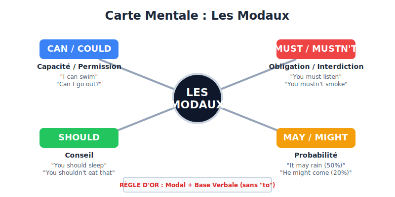
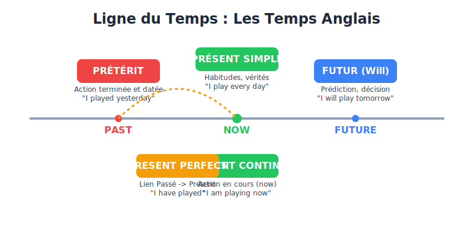

# Le Grand Livre du Brevet 2026

Ce document contient l'intégralité des fiches de révision pour le Brevet.

## Table des matières

- [ENGLISH](#english)
- [FRANCAIS](#francais)
- [HISTOIRE-GEO-EMC](#histoire-geo-emc)
- [MATHS](#maths)
- [SCIENCES](#sciences)

---

<h1 id="english" style="page-break-before: always;">ENGLISH</h1>

## Grammaire : Les Modaux

### 🎯 Objectifs Pédagogiques
- Comprendre le fonctionnement unique des verbes modaux en anglais.
- Exprimer la capacité et la permission (Can / Could).
- Exprimer l'obligation et l'interdiction (Must).
- Donner un conseil (Should).
- Exprimer la probabilité (May / Might).

---

### 💡 Concision & Pédagogie

#### 1. La Règle d'Or des Modaux
Les modaux sont des "super-auxiliaires" qui modifient le sens du verbe. Ils obéissent à **3 règles strictes** :
1. Ils sont **toujours suivis de la Base Verbale** (le verbe à l'infinitif sans "to"). *Ex: He can swim (et non He can to swim).*
2. Ils sont **invariables** : on ne met **JAMAIS de "s"** à la 3ème personne du singulier. *Ex: She must go (et non She musts go).*
3. Ils se suffisent à eux-mêmes pour faire des questions et des négations (pas besoin de "do" ou "does"). *Ex: Can you help me? / I shouldn't eat this.*

#### 2. Can / Could (Capacité et Permission)
- **CAN** : Exprime ce qu'on sait faire (capacité) ou ce qu'on a le droit de faire (permission) au présent.
  - *Ex: I can speak English. / Can I go to the toilet?*
- **CAN'T (Cannot)** : Incapacité ou impossibilité.
- **COULD** : C'est le passé de "can". Exprime une capacité dans le passé ou une demande polie.
  - *Ex: When I was 5, I could run fast. / Could you open the window, please?*

#### 3. Must / Mustn't (Obligation et Interdiction)
- **MUST** : Exprime une obligation forte, un ordre venu de soi-même ou d'une règle absolue.
  - *Ex: I must do my homework.* (Il faut que je fasse mes devoirs).
- **MUSTN'T (Must not)** : Exprime une **interdiction stricte**.
  - *Ex: You mustn't smoke here.* (Il est interdit de fumer ici).
  - *Attention* : L'absence d'obligation ("tu n'es pas obligé de") se dit *don't have to*, pas mustn't !

#### 4. Should / Shouldn't (Conseil)
- **SHOULD** : Exprime un conseil, ce qu'il serait bien de faire.
  - *Ex: You look tired, you should sleep.* (Tu devrais dormir).
- **SHOULDN'T** : Exprime un reproche ou un conseil négatif.
  - *Ex: You shouldn't eat too much sugar.* (Tu ne devrais pas manger trop de sucre).

#### 5. May / Might (Probabilité)
- **MAY** : Exprime une probabilité moyenne (50% de chances). S'utilise aussi pour demander la permission de façon très polie.
  - *Ex: It may rain tomorrow. / May I come in?*
- **MIGHT** : Exprime une probabilité faible (20% de chances).
  - *Ex: He might be late.* (Il se pourrait qu'il soit en retard).

---

### 🧠 Fiche Mémo

---

### 🛠 Adaptation (Astuces et Pièges)
- **Piège classique** : Ne jamais écrire "to" après un modal ! *I must to go* est une erreur très grave. On dit **I must go**.
- **Astuce Prononciation** : Dans *Should* et *Could*, le "L" est muet ! On prononce "choud" et "coud".
- **Piège Mustn't** : Beaucoup d'élèves pensent que *mustn't* veut dire "ne pas devoir". C'est faux, c'est une **interdiction** (Il ne faut pas).

---

### 🚀 Activités & Exemples
**Associer la bonne intention au bon modal :**
1. *You \_\_\_\_\_\_ wear a uniform at school.* $\rightarrow$ C'est une règle stricte : **must**.
2. *I \_\_\_\_\_\_ play the guitar.* $\rightarrow$ C'est une capacité : **can**.
3. *You have a headache? You \_\_\_\_\_\_ take an aspirin.* $\rightarrow$ C'est un conseil : **should**.

---

### 📝 Exercices Corrigés (Type Brevet)

**Exercice 1 :**
Traduisez ces phrases en anglais en utilisant le bon modal.
1. Tu ne devrais pas regarder la télé si tard.
2. Il est interdit de courir dans les couloirs.
3. Sais-tu nager ?
*Correction :*
1. You **shouldn't** watch TV so late. (Conseil négatif)
2. You **mustn't** run in the corridors. (Interdiction)
3. **Can** you swim? (Capacité)

---

### ❓ FAQ
- **Q : Quelle est la différence entre "Must" et "Have to" ?**
  - R : *Must* est un modal, l'obligation vient souvent de celui qui parle (règle interne). *Have to* n'est pas un modal (il se conjugue avec do/does), l'obligation vient de l'extérieur (une loi, une circonstance). Au collège, on les considère souvent comme des synonymes pour l'obligation.
- **Q : Comment on met un modal au futur ?**
  - R : Les modaux n'ont pas de futur ! On utilise leurs équivalents. Pour *can*, on dira *will be able to*. Pour *must*, on dira *will have to*.

---

## Grammaire : Les Temps de l'Indicatif

### 🎯 Objectifs Pédagogiques
- Différencier le présent simple et le présent en be + -ing.
- Utiliser le prétérit pour raconter des événements passés et datés.
- Comprendre l'usage du present perfect (lien passé-présent).
- Exprimer le futur.

---

### 💡 Concision & Pédagogie

#### 1. Le Présent
- **Présent Simple** : Habitudes, vérités générales, goûts.
  - *Formation* : Base verbale (+ 's' à la 3ème personne du singulier : he/she/it).
  - *Mots-clés* : always, usually, often, sometimes, never, every day.
  - *Exemple* : He **plays** tennis every Sunday.
- **Présent be + -ing (Continu)** : Action en train de se dérouler au moment où l'on parle, ou action temporaire.
  - *Formation* : Auxiliaire BE (am/is/are) + Verbe en -ing.
  - *Mots-clés* : now, at the moment, look!, listen!.
  - *Exemple* : Look! She **is playing** tennis.

#### 2. Le Passé
- **Prétérit Simple** : Action passée, terminée et **datée** (le moment exact est connu ou sous-entendu).
  - *Formation* : Verbes réguliers (+ -ed). Verbes irréguliers (2ème colonne de la liste).
  - *Mots-clés* : yesterday, last week, in 2010, two days ago.
  - *Exemple* : I **visited** London last year. / I **went** to the cinema yesterday.
- **Prétérit be + -ing** : Action qui était en train de se dérouler dans le passé (souvent interrompue par une action au prétérit simple).
  - *Formation* : Auxiliaire BE au passé (was/were) + Verbe en -ing.
  - *Exemple* : I **was watching** TV when the phone **rang**.

#### 3. Le Present Perfect
- **Usage** : Action passée qui a un lien avec le présent (conséquence visible, bilan, expérience de vie). Le moment exact n'est pas important.
- *Formation* : Auxiliaire HAVE (have/has) + Participe passé (Verbe régulier + -ed OU 3ème colonne des verbes irréguliers).
- *Mots-clés* : already, just, yet, ever, never, since (point de départ), for (durée).
- *Exemple* : I **have lost** my keys. (Conséquence : je ne peux pas rentrer chez moi maintenant).

#### 4. Le Futur
- **Will + Base Verbale** : Prédiction, décision spontanée.
  - *Exemple* : I think it **will rain** tomorrow.
- **Be going to + Base Verbale** : Intention, plan prévu à l'avance.
  - *Exemple* : I **am going to visit** my grandparents next weekend.

---

### 🧠 Fiche Mémo

---

### 🛠 Adaptation (Astuces et Pièges)
- **Astuce 3ème personne** : N'oublie jamais le "S" à la 3ème personne du singulier au présent simple (He like**s**, She go**es**).
- **Piège Prétérit vs Present Perfect** : Si la phrase contient une date précise dans le passé (yesterday, in 2015), c'est **toujours** du prétérit. Jamais de present perfect avec une date passée précise !
- **Astuce Questions/Négations** : Au présent simple et au prétérit, on a besoin de l'auxiliaire **DO** (do/does/don't/doesn't) ou **DID** (did/didn't) pour poser une question ou faire une phrase négative.

---

### 🚀 Activités & Exemples
**Choisis le bon temps :**
1. Listen! The baby (cry). $\rightarrow$ *is crying* (action en cours, mot-clé "Listen!").
2. I (go) to New York in 2018. $\rightarrow$ *went* (action passée et datée, verbe irrégulier).
3. He (never / eat) sushi. $\rightarrow$ *has never eaten* (expérience de vie, mot-clé "never").

---

### 📝 Exercices Corrigés (Type Brevet)

**Exercice 1 :**
Mettez les verbes entre parenthèses au temps qui convient (Présent simple ou Présent be+ing).
1. My brother usually (play) video games after school.
2. But today, he (read) a book.
*Correction :*
1. **plays** (Habitude, mot-clé "usually". Attention au "s" car "My brother" = "he").
2. **is reading** (Action temporaire, en train de se passer, mot-clé "today").

**Exercice 2 :**
Mettez les verbes entre parenthèses au temps qui convient (Prétérit ou Present Perfect).
1. I (lose) my phone yesterday.
2. Oh no! I (lose) my phone! I can't call my mom.
*Correction :*
1. **lost** (Action passée et datée avec "yesterday").
2. **have lost** (Action passée mais avec une conséquence sur le présent : "I can't call my mom").

---

### ❓ FAQ
- **Q : Quelle est la différence entre "since" et "for" avec le present perfect ?**
  - R : "Since" indique un point de départ précis (Since 2010, since Monday). "For" indique une durée (For 10 years, for two weeks).
- **Q : Comment apprendre les verbes irréguliers ?**
  - R : Apprends-les par petits groupes (ex: 5 par jour) et regroupe ceux qui se ressemblent (ex: sing/sang/sung, ring/rang/rung).

---

<h1 id="francais" style="page-break-before: always;">FRANCAIS</h1>

## Classes et Fonctions

#### 1. Classes grammaticales (Nature)
<callout type="tip" title="Astuce">
La nature d'un mot est son identité, elle ne change (presque) jamais.
</callout>

*   **Mots variables** :
    *   *Nom* (commun/propre) : désigne un être, une chose, une idée.
    *   *Déterminant* (article, possessif, démonstratif, indéfini) : précède le nom.
    *   *Adjectif qualificatif* : caractérise le nom.
    *   *Pronom* (personnel, relatif, démonstratif, possessif) : remplace un nom.
    *   *Verbe* : exprime une action ou un état.
*   **Mots invariables** :
    *   *Adverbe* : modifie le sens d'un verbe, d'un adjectif ou d'un autre adverbe (ex: *très, rapidement, hier*).
    *   *Préposition* : introduit un complément (ex: *à, de, pour, sur, avec, sans*).
    *   *Conjonction de coordination* : relie des mots ou propositions de même nature (*mais, ou, et, donc, or, ni, car*).
    *   *Conjonction de subordination* : introduit une proposition subordonnée (*que, quand, parce que, si, bien que*).
    *   *Interjection / Onomatopée* : exprime un sentiment ou un bruit (*Ah !, Boum !*).

#### 2. Fonctions par rapport au Verbe
<callout type="info" title="Rappel">
La fonction est le rôle du mot dans la phrase. Elle change selon la phrase.
</callout>

*   **Sujet** : fait l'action (Qui est-ce qui ?).
*   **Complément d'Objet Direct (COD)** : subit l'action, sans préposition (Quoi ? Qui ?).
*   **Complément d'Objet Indirect (COI)** : subit l'action, introduit par une préposition (À qui ? De quoi ?).
*   **Attribut du sujet** : donne une caractéristique au sujet, après un verbe d'état (*être, paraître, sembler, devenir, rester, avoir l'air*).
*   **Compléments Circonstanciels (CC)** : précisent les circonstances de l'action (Temps, Lieu, Manière, Cause, But, Conséquence, Moyen). Ils sont souvent déplaçables et supprimables.

#### 3. Expansions du Nom
Elles enrichissent le groupe nominal (GN) et complètent le nom noyau.
*   **Épithète** : adjectif qualificatif placé directement à côté du nom (ex: *un chat **noir***).
*   **Complément du nom (CdN)** : groupe prépositionnel (ex: *la maison **de mon père***).
*   **Apposition** : mot ou groupe de mots séparé du nom par une virgule (ex: *Paris, **capitale de la France**, est belle*).
*   **Proposition subordonnée relative** : introduite par un pronom relatif (*qui, que, quoi, dont, où*) (ex: *le livre **que je lis***).

---

## La phrase complexe

#### 1. Phrase simple vs complexe
<definition-box term="Phrase simple">
Contient un seul verbe conjugué (donc une seule proposition).
</definition-box>

<definition-box term="Phrase complexe">
Contient plusieurs verbes conjugués (donc plusieurs propositions).
</definition-box>

#### 2. Relier des propositions indépendantes
*   **Juxtaposition** : les propositions sont séparées par un signe de ponctuation faible (virgule, point-virgule, deux-points).
    *   *Exemple* : [Il pleut], [je prends mon parapluie].
*   **Coordination** : les propositions sont reliées par une conjonction de coordination (*mais, ou, et, donc, or, ni, car*) ou un adverbe de liaison (*puis, ensuite, cependant*).
    *   *Exemple* : [Il pleut] **donc** [je prends mon parapluie].

#### 3. La Subordination
Une proposition subordonnée dépend d'une proposition principale (elle ne peut pas exister seule).
*   **Subordonnée Relative** :
    *   Complète un nom (l'antécédent).
    *   Introduite par un pronom relatif (*qui, que, quoi, dont, où, lequel*).
    *   *Exemple* : Le chien [**qui** aboie] est à mon voisin.
*   **Subordonnée Complétive (Conjonctive)** :
    *   Complète un verbe (souvent fonction COD).
    *   Introduite par la conjonction de subordination *que*.
    *   *Exemple* : Je pense [**qu'**il va pleuvoir].
*   **Subordonnée Interrogative Indirecte** :
    *   Complète un verbe de questionnement ou d'ignorance (*se demander, ignorer*).
    *   Introduite par un mot interrogatif (*si, comment, pourquoi, où*).
    *   *Exemple* : Je me demande [**si** tu viendras].
*   **Subordonnée Circonstancielle** :
    *   Complète la phrase (fonction CC de temps, cause, but, condition, concession...).
    *   Introduite par une conjonction de subordination (*quand, parce que, pour que, si, bien que*).
    *   *Exemple* : Je sortirai [**quand** il fera beau].

<mini-quiz 
  question="Dans la phrase 'Le chat que je regarde dort', quelle est la nature de la proposition 'que je regarde' ?" 
  options='["Proposition subordonnée relative", "Proposition subordonnée complétive", "Proposition indépendante coordonnée", "Proposition subordonnée circonstancielle"]' 
  correctanswer="0" 
  explanation="C'est une proposition subordonnée relative car elle est introduite par le pronom relatif 'que' et elle complète le nom antécédent 'chat'."
></mini-quiz>

---

## Le Verbe et les Temps

#### 1. Valeurs du Présent de l'Indicatif
*   **Énonciation (Actuel)** : L'action se déroule au moment où l'on parle.
*   **Habitude (Répétition)** : L'action se répète régulièrement.
*   **Vérité générale** : Fait toujours vrai (proverbes, sciences).
*   **Narration** : Rend une action passée plus vivante dans un récit au passé.

#### 2. Le système des temps du récit au passé
*   **L'Imparfait (Temps de l'arrière-plan)** :
    *   *Description* : Le décor, les personnages.
    *   *Habitude* : Actions répétées dans le passé.
    *   *Action secondaire/en cours* : Action non achevée, qui dure.
*   **Le Passé Simple (Temps du premier plan)** :
    *   *Action soudaine* : Événement inattendu qui vient couper l'imparfait.
    *   *Action brève et achevée* : Délimitée dans le temps.
    *   *Succession d'actions* : Fait avancer le récit (actions chronologiques).

#### 3. Les autres modes
*   **Le Subjonctif** : Mode de l'incertain, du possible, du souhait, de l'ordre, de la crainte.
    *   Souvent après *que* (ex: *Il faut que tu **viennes***).
*   **Le Conditionnel** :
    *   *Valeur modale* : Exprime une condition (avec *si* à l'imparfait), une hypothèse, un souhait, un regret, ou une politesse atténuée (ex: *Je **voudrais** un café*).
    *   *Valeur temporelle (Futur dans le passé)* : Exprime une action future par rapport à un repère passé (ex: *Il a dit qu'il **viendrait** demain*).
*   **L'Impératif** : Mode de l'ordre, du conseil, de la prière ou de l'interdiction. (Pas de pronom sujet exprimé).

---

## Les discours rapportés

#### 1. Le Discours Direct
*   **Définition** : Rapporte les paroles exactement telles qu'elles ont été prononcées.
*   **Caractéristiques** :
    *   Verbe introducteur de parole (*dire, répondre, s'exclamer*).
    *   Ponctuation spécifique : deux-points (:), guillemets (« »), tirets (-) pour les dialogues.
    *   Présence de marques de l'oralité (interjections, points d'exclamation/interrogation).
    *   Ancrage dans la situation d'énonciation (Je/Tu, Ici, Maintenant).

#### 2. Le Discours Indirect
*   **Définition** : Intègre les paroles au récit, sans rupture syntaxique.
*   **Caractéristiques** :
    *   Verbe introducteur suivi d'une proposition subordonnée (souvent complétive introduite par *que* ou interrogative indirecte introduite par *si*).
    *   Pas de ponctuation de dialogue.
    *   Changement des pronoms personnels (Je $\rightarrow$ Il/Elle).
    *   Changement des repères spatio-temporels (Ici $\rightarrow$ Là-bas, Aujourd'hui $\rightarrow$ Ce jour-là).
    *   **Concordance des temps** (si le verbe introducteur est au passé) : Présent $\rightarrow$ Imparfait, Futur $\rightarrow$ Conditionnel, Passé composé $\rightarrow$ Plus-que-parfait.

#### 3. Le Discours Indirect Libre
*   **Définition** : Mélange les caractéristiques du discours direct et indirect. Souvent utilisé dans les romans pour exprimer les pensées intimes d'un personnage.
*   **Caractéristiques** :
    *   Pas de verbe introducteur, pas de ponctuation de dialogue (comme l'indirect).
    *   Conserve les marques d'expressivité (exclamations, interrogations) et le vocabulaire familier du personnage (comme le direct).
    *   Les pronoms et les temps sont ceux du récit (3ème personne, imparfait/passé simple).

---

## Accords et Formation des mots

#### 1. L'accord du participe passé
*   **Employé sans auxiliaire (comme adjectif)** : S'accorde en genre et en nombre avec le nom qu'il qualifie.
*   **Avec l'auxiliaire ÊTRE** : S'accorde **toujours** avec le Sujet.
    *   *Exemple* : *Elles sont parti**es**.*
*   **Avec l'auxiliaire AVOIR** :
    *   Ne s'accorde **JAMAIS** avec le sujet.
    *   S'accorde avec le **COD** **UNIQUEMENT SI** le COD est placé **AVANT** le verbe.
    *   *Exemple 1* : *Elles ont mangé la pomme.* (COD "la pomme" après $\rightarrow$ pas d'accord).
    *   *Exemple 2* : *La pomme qu'elles ont mangé**e**.* (COD "qu'" mis pour "la pomme" placé avant $\rightarrow$ accord féminin singulier).
*   **Verbes pronominaux (se laver, s'enfuir)** : Règle complexe, mais en général, s'accorde avec le sujet si le pronom réfléchi n'a pas de fonction COI.

#### 2. Formation des mots
*   **Dérivation** : Ajout d'affixes à un radical (racine).
    *   *Préfixe* : Avant le radical (modifie le sens : *in-*, *dé-*, *re-*).
    *   *Suffixe* : Après le radical (modifie la classe grammaticale : *-able*, *-ment*, *-tion*).
*   **Composition** : Assemblage de deux mots existants (ex: *porte-manteau, chou-fleur*).
*   **Famille de mots** : Ensemble de mots formés sur le même radical (ex: *terre, terrain, atterrir, terrestre*).

#### 3. Sémantique (Sens des mots)
*   **Polysémie** : Un mot qui a plusieurs sens selon le contexte (ex: *une carte* à jouer, *une carte* géographique).
*   **Synonymes** : Mots de même sens (ou sens très proche).
*   **Antonymes** : Mots de sens contraire.
*   **Champ lexical** : Ensemble de mots se rapportant à un même thème (ex: *voile, vent, marin, bateau, vague* $\rightarrow$ champ lexical de la mer).

#### 4. Les principales Figures de Style
*   **Comparaison** : Rapproche deux éléments (comparé et comparant) avec un outil de comparaison (*comme, tel, ressembler à*).
*   **Métaphore** : Comparaison sous-entendue, sans outil de comparaison (ex: *Cet homme est un lion*).
*   **Personnification** : Prêter des qualités humaines à un objet ou un animal.
*   **Antithèse** : Opposition forte entre deux mots ou idées dans une même phrase.
*   **Oxymore** : Alliance de deux mots de sens contraire placés côte à côte (ex: *Cette obscure clarté*).
*   **Hyperbole** : Exagération forte (ex: *Je meurs de faim*).
*   **Énumération / Accumulation** : Liste de termes pour créer un effet d'abondance.

---

## Se raconter, se représenter

#### 1. L'Autobiographie (Définition)
*   **Pacte autobiographique (Philippe Lejeune)** : L'auteur s'engage à dire la vérité sur sa vie, et le lecteur s'engage à le croire.
*   **Identité** : Auteur = Narrateur = Personnage principal (Je).
*   **Double énonciation** : Le "Je" narrant (l'adulte qui écrit aujourd'hui) et le "Je" narré (l'enfant/adolescent qui a vécu les faits dans le passé).

#### 2. Les enjeux de l'écriture de soi
*   **Pourquoi écrire sur soi ?**
    *   Laisser une trace, lutter contre l'oubli.
    *   Se justifier, s'expliquer (apologie).
    *   Témoigner d'une époque historique (ex: Anne Frank, Primo Levi).
    *   Faire un bilan de sa vie, mieux se comprendre (introspection).
    *   Se libérer d'un traumatisme (catharsis).

#### 3. Les limites et difficultés
*   **La mémoire** : Les souvenirs sont souvent flous, déformés ou oubliés.
*   **La subjectivité** : On ne raconte que sa propre vision des choses, pas la vérité absolue.
*   **La pudeur** : Difficulté à avouer ses fautes ou ses secrets.
*   **L'idéalisation** : Tendance à embellir le passé (surtout l'enfance).

#### 4. Formes proches
*   **Mémoires** : L'auteur met l'accent sur les événements historiques dont il a été témoin, plus que sur sa vie intime (ex: De Gaulle).
*   **Journal intime** : Écrit au jour le jour, sans destinataire public (en théorie).
*   **Roman autobiographique** : L'auteur s'inspire de sa vie mais change les noms et invente certains faits (fiction).

---

## Dénoncer les travers de la société

#### 1. La Satire
*   **Définition** : Œuvre (texte, dessin) qui critique en se moquant. Elle s'attaque aux vices, aux ridicules d'une époque, d'un groupe social ou d'une institution.
*   **But** : Faire rire pour faire réfléchir (Castigat ridendo mores : "Elle corrige les mœurs en riant").
*   **Procédés** : L'exagération (hyperbole, caricature), le portrait péjoratif, le registre comique ou burlesque.

#### 2. L'Ironie
*   **Définition** : Figure de rhétorique (l'antiphrase) qui consiste à dire le contraire de ce que l'on pense, tout en faisant comprendre ce que l'on pense vraiment.
*   **But** : Créer une connivence avec le lecteur intelligent, rabaisser l'adversaire.
*   **Indices** : Le ton, le contexte, l'exagération absurde.

#### 3. La Fable et le Conte philosophique
*   **L'Apologue** : Court récit allégorique (fable, conte) contenant un enseignement moral.
*   **Structure** : Un récit (le corps) plaisant à lire, et une morale (l'âme) explicite ou implicite.
*   **Avantage** : Permet de contourner la censure en critiquant indirectement (souvent en utilisant des animaux pour représenter les humains, ex: La Fontaine).

#### 4. L'Argumentation
*   **Thèse** : L'idée défendue par l'auteur (son opinion).
*   **Arguments** : Les raisons, les preuves logiques qui soutiennent la thèse.
*   **Exemples** : Faits concrets, anecdotes, chiffres qui illustrent et prouvent l'argument.
*   **Connecteurs logiques** : Mots de liaison essentiels pour structurer le discours (Cause : *en effet, car* ; Conséquence : *donc, c'est pourquoi* ; Opposition : *mais, cependant, en revanche* ; Addition : *de plus, par ailleurs*).

---

## Visions poétiques et Agir dans la cité

#### 1. La Poésie Lyrique
*   **Définition** : Expression des sentiments personnels et intimes du poète (amour, fuite du temps, mort, nature, mélancolie).
*   **Caractéristiques** :
    *   Omniprésence de la première personne (Je).
    *   Musicalité : rimes, rythme, assonances (répétition de voyelles), allitérations (répétition de consonnes).
    *   Richesse des figures de style (métaphores, comparaisons).

#### 2. La Poésie Engagée
*   **Définition** : Le poète met son art au service d'une cause politique, sociale ou morale. Il prend parti.
*   **But** : Dénoncer une injustice (guerre, racisme, dictature), appeler à la révolte, rendre hommage aux victimes ou aux héros (ex: poètes de la Résistance comme Éluard ou Aragon).
*   **Caractéristiques** : Registre épique (héroïsme), registre pathétique (susciter la pitié), utilisation du "Nous" (solidarité).

#### 3. Le Théâtre
*   **Spécificité** : Un texte écrit pour être joué (représentation). Double énonciation (les personnages se parlent entre eux, mais parlent aussi au public).
*   **Vocabulaire** :
    *   *Didascalies* : Indications scéniques de l'auteur (en italique : gestes, ton, décor).
    *   *Réplique* : Prise de parole d'un personnage.
    *   *Tirade* : Longue réplique.
    *   *Monologue* : Personnage seul sur scène qui se parle à lui-même (révèle ses pensées au public).
    *   *Aparté* : Personnage qui parle au public sans que les autres personnages sur scène ne l'entendent.
*   **Genres** :
    *   *Tragédie* : Personnages nobles, destin fatal, fin malheureuse (mort), suscite terreur et pitié.
    *   *Comédie* : Personnages bourgeois/peuple, défauts humains, fin heureuse (mariage), but : faire rire et corriger les mœurs.

---

## Progrès et rêves scientifiques

#### 1. La Science-Fiction (SF)
*   **Définition** : Genre littéraire et cinématographique qui imagine ce que pourrait être le futur en se basant sur les connaissances scientifiques et technologiques actuelles.
*   **Thèmes fréquents** : Le voyage dans l'espace ou le temps, les robots et l'intelligence artificielle, les manipulations génétiques, la rencontre avec des extraterrestres, la fin du monde (post-apocalyptique).
*   **Enjeu** : S'interroger sur les conséquences du progrès scientifique sur l'humanité (Le progrès est-il toujours positif ?).

#### 2. L'Utopie
*   **Définition** : (Du grec *ou-topos*, le lieu qui n'existe pas). Représentation d'une société idéale, parfaite, où les hommes vivent heureux et en harmonie.
*   **But** : Critiquer la société réelle de l'auteur en montrant un modèle parfait (souvent imaginaire, sur une île lointaine).

#### 3. La Dystopie (Contre-utopie)
*   **Définition** : Récit décrivant une société imaginaire organisée de telle façon qu'elle empêche ses membres d'atteindre le bonheur. C'est une utopie qui a mal tourné.
*   **Caractéristiques** :
    *   Régime totalitaire, dictature.
    *   Surveillance permanente des citoyens.
    *   Privation des libertés individuelles (liberté de penser, d'aimer).
    *   Uniformisation de la société.
*   **But** : Mettre en garde le lecteur contre les dérives possibles de notre propre société (ex: *1984* de George Orwell, *Fahrenheit 451* de Ray Bradbury).

---

## Méthodologie du Brevet (1/2)

#### 1. Compréhension de texte (Questions)
*   **Lire attentivement** : Le texte, mais aussi le paratexte (auteur, titre de l'œuvre, date de publication) qui donne des indices cruciaux.
*   **Répondre en rédigeant** : Faire des phrases complètes (Sujet + Verbe + Complément). Reprendre les termes de la question.
*   **Justifier TOUJOURS** : Citer le texte entre guillemets (« ... ») et indiquer le numéro de la ligne (l. X).
*   **Analyser, ne pas paraphraser** : Si on demande l'effet produit par une figure de style, il faut nommer la figure, la citer, et expliquer ce qu'elle apporte au sens du texte.

#### 2. Grammaire et Compétences linguistiques
*   **Analyse de phrase** : Savoir identifier la nature et la fonction des mots.
*   **Valeur des temps** : Savoir justifier l'emploi de l'imparfait ou du passé simple.
*   **Formation des mots** : Savoir décomposer un mot (préfixe-radical-suffixe) pour en expliquer le sens.

#### 3. La Réécriture
*   **Principe** : Réécrire un court passage en modifiant le temps, la personne (ex: passer de "Je" à "Nous", ou du présent au passé).
*   **Méthode** :
    1.  Identifier tous les changements demandés.
    2.  Repérer dans le texte tous les mots qui vont devoir changer (verbes, pronoms personnels, déterminants possessifs, accords des adjectifs et participes).
    3.  Faire les modifications au brouillon.
    4.  Relire pour vérifier qu'on n'a rien oublié (attention aux accords en chaîne !).

#### 4. La Dictée
*   **Temps de relecture (10 min)** : C'est le moment le plus important !
*   **Check-list de relecture** :
    1.  *Majuscules et ponctuation*.
    2.  *Accords Sujet-Verbe* : Chercher le sujet de chaque verbe conjugué.
    3.  *Accords dans le Groupe Nominal* : Déterminant + Nom + Adjectif (genre et nombre).
    4.  *Homophones grammaticaux* : a/à, et/est, son/sont, ce/se, ou/où.
    5.  *Participe passé (-é) ou Infinitif (-er)* : Remplacer par un verbe du 3e groupe (vendu/vendre, mordu/mordre).

---

## Méthodologie du Brevet (2/2)

#### 1. Le choix du sujet
À l'épreuve de rédaction (1h30), vous avez le choix entre deux sujets. Lisez bien les deux consignes avant de choisir.
*   **Sujet d'imagination** : Inventer une suite, écrire une lettre, un dialogue, un récit à partir du texte.
*   **Sujet de réflexion** : Argumenter sur une question en lien avec le thème du texte.

#### 2. Le Sujet d'Imagination
*   **Respecter les contraintes** : Le type de texte (lettre, dialogue, récit, journal intime), le système d'énonciation (qui parle ? à qui ?), le temps des verbes (passé ou présent), le registre de langue.
*   **Cohérence avec le texte source** : Respecter le caractère des personnages, l'époque, le lieu.
*   **Structure** :
    *   Si c'est un récit : Situation initiale, Élément perturbateur, Péripéties, Dénouement, Situation finale.
    *   Si c'est un dialogue : Utiliser la ponctuation adéquate (tirets, guillemets) et des verbes de parole variés.
*   **Richesse du vocabulaire** : Utiliser des adjectifs, des figures de style, éviter les répétitions.

#### 3. Le Sujet de Réflexion
*   **Analyse du sujet** : Repérer les mots-clés de la question. Définir la thèse à défendre (ou les deux thèses si on demande de nuancer).
*   **Recherche d'idées (Brouillon)** : Trouver 2 ou 3 arguments solides. Pour chaque argument, trouver un exemple précis (tiré de votre culture personnelle, des œuvres étudiées en classe, de l'actualité).
*   **Structure du devoir (Plan)** :
    *   **Introduction** : Amener le sujet (constat général), poser la problématique (reformuler la question), annoncer le plan.
    *   **Développement** : 2 ou 3 paragraphes. (1 paragraphe = 1 argument + 1 exemple + 1 explication).
    *   **Conclusion** : Bilan (réponse à la question) et ouverture (élargir le sujet).
*   **Mise en page et Liens logiques** :
    *   Sauter une ligne entre l'intro, le développement et la conclusion.
    *   Faire un alinéa au début de chaque paragraphe.
    *   Utiliser des connecteurs logiques (*Tout d'abord, Ensuite, De plus, Cependant, En conclusion*).

---

<h1 id="histoire-geo-emc" style="page-break-before: always;">HISTOIRE-GEO-EMC</h1>

## La Première Guerre mondiale (1914-1918)

#### 1. Les phases du conflit
<flashcard front="1914-1918" back="Dates de la Première Guerre mondiale"></flashcard>

*   **Août 1914** : Début de la guerre suite à l'attentat de Sarajevo.
*   **1914** : Guerre de mouvement (offensives rapides).
*   **1915-1917** : Guerre de position (les armées s'enterrent dans les tranchées). Bataille de Verdun (1916).
*   **1917** : Tournant de la guerre (Mutineries, Révolution russe et retrait de la Russie, Entrée en guerre des États-Unis).
*   **1918** : Reprise de la guerre de mouvement.
*   **11 novembre 1918** : Armistice (fin des combats).
*   **1919** : Traité de Versailles (l'Allemagne est jugée seule responsable).

#### 2. Une violence de masse
*   **Les Poilus dans les tranchées** : Conditions de vie effroyables (boue, rats, froid, manque d'hygiène - les "Gueules cassées"). Utilisation d'armes nouvelles et destructrices (artillerie lourde, gaz asphyxiants, lance-flammes, chars).
*   **Le génocide des Arméniens (1915)** : L'Empire ottoman (allié de l'Allemagne) déporte et massacre sa minorité arménienne chrétienne, accusée de trahison. Bilan : plus d'un million de morts. C'est le premier génocide du XXe siècle.

#### 3. Une guerre totale
La guerre mobilise toutes les ressources des États :
*   **Militaires** : Des millions d'hommes mobilisés (y compris les troupes coloniales).
*   **Économiques** : Reconversion des usines (ex: Renault fabrique des obus et des chars), emprunts nationaux pour financer l'effort de guerre.
*   **Humaines (à l'arrière)** : Les femmes ("munitionnettes") remplacent les hommes dans les usines et les champs.
*   **Psychologiques** : Propagande ("bourrage de crâne") et censure pour maintenir le moral de la population et cacher la réalité des combats.

---

## Démocraties et Totalitarismes (1919-1939)

#### 1. Les régimes totalitaires
<definition-box term="Régime totalitaire">
Une dictature qui cherche à contrôler totalement la société, l'économie et les esprits, par la terreur et la propagande, pour créer un "homme nouveau".
</definition-box>

*   **L'URSS de Staline (à partir de 1924)** :
    *   *Idéologie* : Communisme (société sans classes, égalitaire).
    *   *Économie* : Étatisation (fin de la propriété privée), collectivisation des terres (kolkhozes), plans quinquennaux (priorité à l'industrie lourde).
    *   *Terreur* : Police politique (NKVD), déportation des opposants (Goulag), Grande Terreur (1937-1938).
    *   *Propagande* : Culte de la personnalité de Staline ("Petit père des peuples"), embrigadement de la jeunesse (Komsomols).

*   **L'Allemagne nazie d'Hitler (1933-1945)** :
    *   *Arrivée au pouvoir* : Hitler, chef du parti nazi (NSDAP), est nommé chancelier en janvier 1933 dans un contexte de crise économique.
    *   *Idéologie* : Raciste et antisémite. Hiérarchie des races (les "Aryens" au sommet, les Juifs considérés comme des "parasites"). Volonté de conquérir un "espace vital" (Lebensraum).
    *   *Terreur* : Gestapo, SS. Lois de Nuremberg (1935) excluant les Juifs de la société. Nuit de Cristal (1938). Premiers camps de concentration (Dachau).
    *   *Propagande* : Culte du chef (Führer), autodafés (livres brûlés), Jeunesses hitlériennes.

#### 2. La France : la crise et le Front Populaire
*   **La crise des années 30** : Crise économique mondiale (chômage) et crise politique en France (scandales, montée des ligues d'extrême droite antiparlementaires qui manifestent violemment le 6 février 1934).
*   **Le Front Populaire (1936)** : Pour contrer le fascisme, les partis de gauche (SFIO, PCF, Radicaux) s'unissent et gagnent les élections. Léon Blum devient chef du gouvernement.
*   **Les Accords Matignon (Juin 1936)** : Suite à des grèves joyeuses, le gouvernement accorde des avancées sociales majeures :
    *   Augmentation des salaires.
    *   Semaine de 40 heures (au lieu de 48h).
    *   2 semaines de congés payés (les premiers départs en vacances).
    *   Reconnaissance des droits syndicaux.

---

## La Seconde Guerre mondiale (1939-1945)

#### 1. Les grandes phases
<flashcard front="1939-1945" back="Dates de la Seconde Guerre mondiale"></flashcard>

*   **1939-1942 : Les victoires de l'Axe** (Allemagne, Italie, Japon).
    *   Septembre 1939 : Invasion de la Pologne par l'Allemagne $\rightarrow$ Début de la guerre.
    *   1940 : Défaite de la France (Blitzkrieg).
    *   1941 : L'Allemagne attaque l'URSS (Opération Barbarossa). Le Japon attaque la base américaine de Pearl Harbor $\rightarrow$ Entrée en guerre des USA. La guerre devient mondiale.
*   **1942-1943 : Le tournant** (Coups d'arrêt).
    *   Stalingrad (URSS), El Alamein (Afrique), Midway (Pacifique). L'Axe recule.
*   **1944-1945 : La victoire des Alliés** (USA, URSS, Royaume-Uni).
    *   1944 : Débarquements en Normandie (juin) et en Provence (août).
    *   8 mai 1945 : Capitulation de l'Allemagne.
    *   Août 1945 : Bombes atomiques sur Hiroshima et Nagasaki.
    *   2 septembre 1945 : Capitulation du Japon $\rightarrow$ Fin de la guerre.

#### 2. Une guerre d'anéantissement
*   **Objectif** : Détruire totalement l'adversaire (militaires ET civils).
*   **Moyens** : Bombardements massifs des villes (Londres, Dresde, Tokyo), arme atomique.
*   **Bilan** : Plus de 50 millions de morts (majoritairement des civils), traumatismes moraux, destructions matérielles immenses.

#### 3. Le génocide des Juifs et des Tziganes (La Shoah)
*   **Processus d'extermination** :
    *   *Ghettos* : Enfermement et famine (ex: Varsovie).
    *   *Einsatzgruppen* : "Shoah par balles" à l'Est (massacres de masse).
    *   *Camps de la mort (Centres de mise à mort)* : À partir de 1942 (Solution finale). Déportation par trains, sélection à l'arrivée, extermination industrielle dans les chambres à gaz (Zyklon B), crémation des corps. (Ex: Auschwitz-Birkenau, Treblinka).
*   **Bilan** : Près de 6 millions de Juifs et 250 000 Tziganes assassinés.

---

## La France défaite et occupée (1940-1944)

#### 1. La défaite et l'armistice
*   **Mai-Juin 1940** : L'armée française est écrasée par la Blitzkrieg allemande. C'est l'exode (des millions de civils fuient vers le sud).
*   **22 juin 1940** : Le Maréchal Pétain (nouveau chef du gouvernement) signe l'armistice. La France est coupée en deux : zone occupée au Nord, zone "libre" au Sud.

#### 2. Le régime de Vichy et la Collaboration
*   **Fin de la République** : Pétain obtient les pleins pouvoirs (juillet 1940) et fonde l'"État français" à Vichy. C'est un régime autoritaire, antirépublicain et antisémite.
*   **Révolution nationale** : Nouvelle devise "Travail, Famille, Patrie". Rejet de la démocratie et des valeurs de 1789.
*   **La Collaboration** : Pétain rencontre Hitler à Montoire (octobre 1940). L'État français collabore activement avec l'Allemagne :
    *   *Économique* : STO (Service du Travail Obligatoire) envoie des jeunes travailler en Allemagne.
    *   *Policière* : La Milice traque les résistants et les Juifs.
    *   *Antisémite* : Rafle du Vél' d'Hiv (juillet 1942), la police française arrête et livre des milliers de Juifs aux nazis.

#### 3. La Résistance
*   **L'Appel du 18 juin 1940** : Le Général de Gaulle, depuis Londres, refuse la défaite et appelle à continuer le combat. Il fonde la **France Libre** (FFL - Forces Françaises Libres).
*   **La Résistance intérieure** : Des hommes et des femmes s'organisent clandestinement en France (mouvements et réseaux).
    *   *Actions* : Tracts, journaux clandestins, sabotages, renseignements, maquis (refuges armés).
    *   *Unification* : Jean Moulin, envoyé par de Gaulle, unifie les mouvements de résistance en créant le **CNR** (Conseil National de la Résistance) en 1943.
*   **La Libération** : Les FFI (Forces Françaises de l'Intérieur) participent à la libération du territoire aux côtés des Alliés en 1944.

---

## Le monde depuis 1945

#### 1. La Guerre Froide (1947-1991)
*   **Un monde bipolaire** : Opposition entre deux superpuissances et leurs modèles idéologiques.
    *   *Bloc de l'Ouest* : Dirigé par les États-Unis. Démocratie libérale, capitalisme (économie de marché), alliance militaire de l'OTAN.
    *   *Bloc de l'Est* : Dirigé par l'URSS. Dictature communiste, économie planifiée, alliance militaire du Pacte de Varsovie.
*   **L'affrontement indirect** : Pas de conflit armé direct (équilibre de la terreur nucléaire), mais des crises périphériques.
    *   *L'Allemagne et Berlin* : Blocus de Berlin (1948), Mur de Berlin (1961-1989).
    *   *Crise des missiles de Cuba (1962)* : Le monde au bord de la guerre nucléaire.
    *   *Guerres périphériques* : Corée, Vietnam.
*   **La fin** : Chute du mur de Berlin (1989) et éclatement de l'URSS (1991).

#### 2. Indépendances et Décolonisation
*   **Contexte** : Après 1945, les puissances coloniales (France, R-U) sont affaiblies. L'ONU, les USA et l'URSS sont anticolonialistes.
*   **Processus** :
    *   *Pacifique* : Inde (1947, Gandhi).
    *   *Violent (Guerres)* : Indochine (1946-1954), Algérie (1954-1962).
*   **L'émergence du Tiers-Monde** : Conférence de Bandung (1955). Les nouveaux États indépendants refusent de s'aligner sur les deux blocs et réclament un développement économique.

#### 3. La construction européenne
*   **Objectif initial** : Garantir la paix en Europe après 1945 et reconstruire l'économie.
*   **Étapes clés** :
    *   1951 : CECA (Communauté Européenne du Charbon et de l'Acier) entre 6 pays fondateurs (France, RFA, Italie, Benelux).
    *   1957 : Traité de Rome $\rightarrow$ Création de la CEE (Communauté Économique Européenne), un marché commun.
    *   1992 : Traité de Maastricht $\rightarrow$ Création de l'Union Européenne (UE), citoyenneté européenne, monnaie unique (Euro, en 2002).
*   **Élargissements** : Passage de 6 à 27 États membres (intégration des pays de l'Est après 1989).

---

## La France depuis 1945

#### 1. La refondation de la République (1944-1947)
*   **Le GPRF** (Gouvernement Provisoire de la République Française), dirigé par de Gaulle, rétablit la démocratie et applique le programme du CNR.
*   **Avancées sociales et politiques majeures** :
    *   Droit de vote des femmes (1944).
    *   Création de la Sécurité Sociale (1945) pour protéger contre les risques de la vie (maladie, vieillesse).
    *   Nationalisations d'entreprises clés (énergie, banques, transports).

#### 2. La Ve République (depuis 1958)
*   **Création** : En 1958, face à la crise de la guerre d'Algérie, de Gaulle revient au pouvoir et fait rédiger une nouvelle Constitution.
*   **Un pouvoir exécutif fort** : Le Président de la République devient la clé de voûte des institutions. À partir de 1962, il est élu au suffrage universel direct.
*   **La vie politique** :
    *   *Alternance* : Passage du pouvoir de la droite à la gauche (ex: élection de François Mitterrand en 1981).
    *   *Cohabitation* : Situation où le Président et le Premier ministre (issu de la majorité à l'Assemblée) sont de bords politiques opposés (ex: Mitterrand/Chirac en 1986).

#### 3. L'évolution de la société française (1950-1980)
*   **Les Trente Glorieuses (1945-1973)** : Période de forte croissance économique, plein emploi, et augmentation du niveau de vie. Naissance de la société de consommation.
*   **L'émancipation des femmes** :
    *   Loi Neuwirth (1967) : Autorise la contraception (pilule).
    *   Loi Veil (1975) : Légalise l'IVG (Interruption Volontaire de Grossesse).
    *   Travail salarié féminin en forte hausse.
*   **La jeunesse** : Allongement de la scolarité, émergence d'une culture jeune (musique, mode). Crise de Mai 1968 (révolte étudiante et grève générale).
*   **L'immigration** : Appel à la main-d'œuvre étrangère (Europe du Sud, Maghreb) pour la reconstruction et l'industrie. Regroupement familial dans les années 70.

---

## Dynamiques territoriales de la France

#### 1. Les aires urbaines et la métropolisation
*   **Définition** : Une aire urbaine est composée d'une ville-centre, de ses banlieues (le pôle urbain) et d'une couronne périurbaine.
*   **Métropolisation** : Concentration de la population, des richesses et des fonctions de commandement (politique, économique, culturel) dans les grandes villes (métropoles comme Paris, Lyon, Marseille).
*   **Périurbanisation** : Étalement de la ville sur les espaces ruraux environnants. Conséquences : artificialisation des sols, augmentation des migrations pendulaires (trajets domicile-travail), dépendance à l'automobile.

#### 2. Les espaces productifs et leurs évolutions
Un espace productif est un espace aménagé pour produire des richesses.
*   **Espaces agricoles** : Agriculture productiviste (intensive, mécanisée, intégrée à l'industrie agroalimentaire) dans les grandes plaines (Bassin parisien, Bretagne). Développement de l'agriculture biologique et des labels (AOC) face aux enjeux environnementaux.
*   **Espaces industriels** : Désindustrialisation des anciennes régions (Nord, Est). Reconversion vers les hautes technologies (aéronautique, spatial) dans les technopôles, souvent situés au Sud et à l'Ouest (héliotropisme) ou près des métropoles.
*   **Espaces de services (Tertiaire)** : Secteur dominant. Concentration dans les quartiers d'affaires des métropoles (ex: La Défense à Paris) et dans les espaces touristiques (littoraux, montagnes, parcs d'attractions).

#### 3. Les espaces de faible densité
*   **Définition** : Espaces comptant moins de 30 habitants/km² (ex: Diagonale du vide, massifs montagneux).
*   **Atouts et dynamiques** :
    *   Tourisme vert (parcs nationaux, randonnée, ski).
    *   Agriculture de qualité (AOC).
    *   Arrivée de néoruraux (citadins cherchant une meilleure qualité de vie) et de retraités.
    *   Télétravail (si la connexion internet le permet).
*   **Contraintes** : Enclavement (manque de transports), vieillissement de la population, désertification médicale et fermeture des services publics.

---

## Aménagement et La France dans le monde

#### 1. Aménager le territoire
*   **Objectif** : Réduire les inégalités entre les territoires et renforcer la compétitivité de la France.
*   **Les inégalités** : Contraste entre Paris (hypercentre) et la province, entre les métropoles dynamiques et les espaces ruraux isolés, entre les quartiers aisés et les quartiers prioritaires (banlieues).
*   **Les acteurs** :
    *   L'État (historiquement le principal acteur).
    *   Les collectivités territoriales (Régions, Départements, Communes) qui ont de plus en plus de pouvoir (décentralisation).
    *   L'Union Européenne (fonds FEDER).
    *   Les acteurs privés (entreprises, citoyens).
*   **Exemples d'aménagements** : LGV (Lignes à Grande Vitesse), rénovation urbaine, parcs naturels régionaux.

#### 2. Les territoires ultra-marins (DROM-COM)
*   **Définition** : Territoires français situés hors d'Europe (Guadeloupe, Martinique, Guyane, La Réunion, Mayotte, Polynésie, Nouvelle-Calédonie...).
*   **Contraintes** : Éloignement de la métropole, insularité (îles), risques naturels (cyclones, volcans).
*   **Atouts** : Biodiversité exceptionnelle, tourisme, bases militaires et spatiales (Kourou en Guyane), vaste ZEE (Zone Économique Exclusive) qui donne à la France la 2ème surface maritime mondiale.

#### 3. La France et l'UE dans le monde
*   **L'Union Européenne** : Un pôle économique majeur de la mondialisation (marché unique, euro). Mais une puissance politique et militaire encore faible sur la scène internationale.
*   **Le rayonnement de la France** :
    *   *Diplomatique/Militaire* : Membre permanent du Conseil de sécurité de l'ONU (droit de veto), puissance nucléaire, armée déployée dans le monde.
    *   *Culturel* : Francophonie, alliances françaises, musées (Louvre), gastronomie, luxe.
    *   *Économique* : FTN (Firmes Transnationales) puissantes (Total, LVMH, Airbus), 6ème puissance économique mondiale.

---

## La République et la Citoyenneté

#### 1. Les valeurs et symboles de la République
*   **Valeurs** : Liberté, Égalité, Fraternité (la devise).
*   **Symboles** :
    *   Le drapeau tricolore (bleu, blanc, rouge).
    *   L'hymne national (La Marseillaise).
    *   L'allégorie de la République (Marianne).
    *   La fête nationale (14 juillet).
    *   Le sceau et le coq gaulois.

#### 2. Les principes de la République (Article 1 de la Constitution)
La France est une République :
*   **Indivisible** : La loi et la langue (le français) sont les mêmes pour tous sur tout le territoire.
*   **Laïque** : Séparation de l'État et des religions (loi de 1905). L'État est neutre, il garantit la liberté de conscience et de culte, mais interdit les signes religieux ostentatoires à l'école publique (loi de 2004).
*   **Démocratique** : Le pouvoir appartient au peuple ("Gouvernement du peuple, par le peuple, pour le peuple"). Le peuple élit ses représentants au suffrage universel.
*   **Sociale** : L'État cherche à réduire les inégalités et protège les plus fragiles (Sécurité sociale, impôts redistributifs).

#### 3. La Nationalité et la Citoyenneté
*   **Acquérir la nationalité française** :
    *   *Droit du sang* : Avoir au moins un parent français.
    *   *Droit du sol* : Naître en France de parents étrangers (sous conditions d'âge et de résidence).
    *   *Mariage* : Avec un(e) Français(e) (après plusieurs années).
    *   *Naturalisation* : Décision de l'État après demande d'un étranger majeur résidant en France.
*   **Être citoyen français** : C'est avoir des **droits** (politiques : voter, être éligible ; civils : liberté d'expression ; sociaux : éducation, santé) et des **devoirs** (respecter la loi, payer ses impôts, être juré d'assises).
*   **Citoyenneté européenne** : Créée par le traité de Maastricht (1992). Tout citoyen d'un État membre est citoyen européen. Droits : libre circulation et installation dans l'UE, droit de vote aux élections municipales et européennes dans le pays de résidence.

---

## Démocratie, Justice et Défense

#### 1. La vie démocratique (Institutions de la Ve République)
*   **Pouvoir exécutif** (Applique les lois) :
    *   *Président de la République* : Élu pour 5 ans au suffrage universel direct. Chef des armées, nomme le Premier ministre.
    *   *Gouvernement* : Premier ministre et ministres.
*   **Pouvoir législatif** (Vote les lois et le budget) : Le Parlement.
    *   *Assemblée Nationale* : Députés élus par les citoyens. (A le dernier mot en cas de désaccord).
    *   *Sénat* : Sénateurs élus par les grands électeurs (maires, conseillers).
*   **L'engagement** : Les citoyens peuvent s'engager dans des partis politiques, des syndicats (défense des travailleurs) ou des associations (loi 1901).

#### 2. La Justice
*   **Principes** : Indépendance, gratuité, égalité, droit à un procès équitable, présomption d'innocence, droit de faire appel.
*   **Organisation** :
    *   *Justice civile* : Règle les litiges entre personnes (divorce, loyer, contrats). Pas de prison. (Tribunal judiciaire).
    *   *Justice pénale* : Punit les infractions à la loi.
        *   Contraventions (Tribunal de police).
        *   Délits : vol, violences (Tribunal correctionnel).
        *   Crimes : meurtre, viol (Cour d'assises, avec un jury de citoyens).
    *   *Justice des mineurs* : Juge des enfants. Privilégie l'éducatif sur le répressif (excuse de minorité).

#### 3. La Défense et la Paix
*   **Le parcours de citoyenneté** :
    1.  Enseignement de défense (en classe de 3ème).
    2.  Recensement (à 16 ans, obligatoire en mairie).
    3.  JDC (Journée Défense et Citoyenneté) : obligatoire avant 18 ans pour passer le permis ou les examens.
*   **Missions de la Défense** : Protéger le territoire et la population (Vigipirate, Sentinelle), intervenir à l'étranger (OPEX - Opérations Extérieures) pour maintenir la paix sous mandat de l'ONU, dissuasion nucléaire.

---

<h1 id="maths" style="page-break-before: always;">MATHS</h1>

## Arithmétique

#### 1. Multiples et diviseurs
*   Un nombre entier $a$ est un **multiple** de $b$ s'il existe un entier $k$ tel que $a = k \times b$. On dit alors que $b$ est un **diviseur** de $a$.
*   **Critères de divisibilité** :
    *   Par 2 : le chiffre des unités est 0, 2, 4, 6 ou 8 (nombre pair).
    *   Par 3 : la somme de ses chiffres est un multiple de 3.
    *   Par 4 : le nombre formé par ses deux derniers chiffres est un multiple de 4.
    *   Par 5 : le chiffre des unités est 0 ou 5.
    *   Par 9 : la somme de ses chiffres est un multiple de 9.
    *   Par 10 : le chiffre des unités est 0.

#### 2. Nombres premiers
<definition-box term="Nombres premiers">
Un nombre est premier s'il possède **exactement deux diviseurs** : 1 et lui-même.
</definition-box>

<callout type="warning" title="Attention">
1 n'est pas premier (il n'a qu'un seul diviseur).
</callout>

<callout type="tip" title="Liste à connaître (jusqu'à 30)">
2, 3, 5, 7, 11, 13, 17, 19, 23, 29.
</callout>

#### 3. Décomposition en facteurs premiers
*   **Théorème** : Tout nombre entier supérieur ou égal à 2 peut se décomposer en un produit de facteurs premiers. Cette décomposition est unique.
*   *Exemple* : $60 = 2 \times 30 = 2 \times 2 \times 15 = 2 \times 2 \times 3 \times 5 = 2^2 \times 3 \times 5$.
*   **Utilité** : Rendre une fraction irréductible en simplifiant les facteurs communs au numérateur et au dénominateur.

#### 4. Problèmes d'arithmétique
*   **Partage équitable** : Chercher le plus grand diviseur commun (PGCD) pour faire des lots identiques sans reste.
*   **Synchronisation (engrenages, clignotants)** : Chercher le plus petit multiple commun (PPCM) pour savoir quand deux événements se reproduiront en même temps.

<mini-quiz 
  question="Quel est le seul nombre pair qui est aussi un nombre premier ?" 
  options='["0", "2", "4", "Il n&apos;y en a pas"]' 
  correctanswer="1" 
  explanation="2 est le seul nombre pair premier. Tous les autres nombres pairs sont divisibles par 2, ils ont donc plus de deux diviseurs."
></mini-quiz>

---

## Fractions et Nombres relatifs

#### 1. Nombres relatifs
*   **Addition** :
    *   Même signe : on garde le signe et on ajoute les distances à zéro (ex: $-3 + (-4) = -7$).
    *   Signes contraires : on prend le signe de celui qui a la plus grande distance à zéro et on soustrait les distances (ex: $-5 + 2 = -3$).
*   **Soustraction** : Soustraire un nombre revient à ajouter son opposé (ex: $5 - (-3) = 5 + 3 = 8$).
*   **Multiplication et Division (Règle des signes)** :
    *   $+\times+ = +$
    *   $-\times- = +$
    *   $+\times- = -$
    *   $-\times+ = -$

#### 2. Fractions
<callout type="warning" title="Règle d'or">
Pour l'addition et la soustraction, il faut <strong>OBLIGATOIREMENT</strong> mettre les fractions au même dénominateur.
</callout>

<formula-box title="Addition et Soustraction">
$$ \frac{a}{c} + \frac{b}{c} = \frac{a+b}{c} $$
</formula-box>

<formula-box title="Multiplication">
$$ \frac{a}{b} \times \frac{c}{d} = \frac{a \times c}{b \times d} $$
</formula-box>

<formula-box title="Division">
$$ \frac{a}{b} \div \frac{c}{d} = \frac{a}{b} \times \frac{d}{c} $$
</formula-box>

#### 3. Priorités opératoires
1.  Parenthèses (les plus intérieures d'abord)
2.  Puissances
3.  Multiplications et Divisions (de gauche à droite)
4.  Additions et Soustractions (de gauche à droite)

---

## Puissances et Racines carrées

#### 1. Puissances d'un nombre
*   **Définition** : $a^n = a \times a \times ... \times a$ ($n$ facteurs).
*   **Cas particuliers** : $a^0 = 1$ (pour $a \neq 0$) et $a^1 = a$.
*   **Exposant négatif** : $a^{-n} = \frac{1}{a^n}$ (c'est l'inverse de $a^n$).

#### 2. Règles de calcul
<formula-box title="Produit">
$$ a^m \times a^n = a^{m+n} $$
</formula-box>

<formula-box title="Quotient">
$$ \frac{a^m}{a^n} = a^{m-n} $$
</formula-box>

<formula-box title="Puissance de puissance">
$$ (a^m)^n = a^{m \times n} $$
</formula-box>

#### 3. Écriture scientifique
*   **Définition** : Écrire un nombre sous la forme $a \times 10^n$ où :
    *   $a$ est un nombre décimal tel que $1 \le a < 10$ (un seul chiffre non nul avant la virgule).
    *   $n$ est un entier relatif.
*   *Exemple* : $45\,000 = 4.5 \times 10^4$ et $0.0032 = 3.2 \times 10^{-3}$.
*   **Préfixes** : Giga ($10^9$), Méga ($10^6$), Kilo ($10^3$), Milli ($10^{-3}$), Micro ($10^{-6}$), Nano ($10^{-9}$).

#### 4. Racines carrées
*   **Définition** : La racine carrée d'un nombre positif $a$, notée $\sqrt{a}$, est le nombre positif dont le carré vaut $a$.
*   **Carrés parfaits à connaître** : $\sqrt{1}=1$, $\sqrt{4}=2$, $\sqrt{9}=3$, $\sqrt{16}=4$, $\sqrt{25}=5$, $\sqrt{36}=6$, $\sqrt{49}=7$, $\sqrt{64}=8$, $\sqrt{81}=9$, $\sqrt{100}=10$, $\sqrt{121}=11$, $\sqrt{144}=12$.

---

## Calcul littéral

#### 1. Développer et Réduire
*   **Développer** : Transformer un produit en une somme ou une différence.
*   **Simple distributivité** : $k(a+b) = ka + kb$ et $k(a-b) = ka - kb$.
*   **Double distributivité** : $(a+b)(c+d) = ac + ad + bc + bd$.
*   **Réduire** : Regrouper les termes de même nature (les $x^2$ avec les $x^2$, les $x$ avec les $x$, les nombres avec les nombres).
*   *Attention au signe moins devant une parenthèse* : $-(a+b) = -a-b$ et $-(a-b) = -a+b$.

#### 2. Factoriser
*   **Factoriser** : Transformer une somme ou une différence en un produit.
*   **Facteur commun** : $ka + kb = k(a+b)$.
    *   *Exemple* : $3x^2 + 6x = 3x(x) + 3x(2) = 3x(x+2)$.

#### 3. Identités remarquables
<callout type="warning" title="À connaître par cœur">
Dans les deux sens (développement $\rightarrow$ et factorisation $\leftarrow$)
</callout>

<formula-box title="1. Carré d'une somme">
$$ (a+b)^2 = a^2 + 2ab + b^2 $$
</formula-box>

<formula-box title="2. Carré d'une différence">
$$ (a-b)^2 = a^2 - 2ab + b^2 $$
</formula-box>

<formula-box title="3. Différence de deux carrés">
$$ (a+b)(a-b) = a^2 - b^2 $$
</formula-box>

*   *Exemple de factorisation* : $x^2 - 25 = x^2 - 5^2 = (x-5)(x+5)$.

---

## Équations et Inéquations

#### 1. Équations du 1er degré
*   **Principe** : Trouver la valeur de l'inconnue ($x$) qui rend l'égalité vraie.
*   **Règles** : On peut additionner, soustraire, multiplier ou diviser par un même nombre (non nul) les deux membres de l'équation.

<method-box 
  title="Résoudre une équation du 1er degré" 
  steps='["Regrouper les termes en x d&apos;un côté de l&apos;égalité.", "Regrouper les nombres de l&apos;autre côté.", "Réduire chaque côté.", "Diviser par le coefficient de x pour isoler l&apos;inconnue."]'
  example="3x - 5 = x + 7 3x - x = 7 + 5 2x = 12 x = 12 / 2 x = 6"
></method-box>

#### 2. Équations produit nul
*   **Propriété** : Un produit de facteurs est nul si et seulement si au moins l'un des facteurs est nul.
*   **Forme** : $(ax+b)(cx+d) = 0$
*   **Résolution** :
    *   Soit $ax+b = 0 \Rightarrow x = -\frac{b}{a}$
    *   Soit $cx+d = 0 \Rightarrow x = -\frac{d}{c}$
    *   L'équation admet deux solutions.

#### 3. Inéquations du 1er degré
*   **Principe** : Trouver toutes les valeurs de $x$ qui vérifient l'inégalité ($<, \le, >, \ge$).

<callout type="warning" title="Règle d'or (ATTENTION)">
Si on multiplie ou divise les deux membres d'une inéquation par un nombre <strong>NÉGATIF</strong>, on doit <strong>CHANGER LE SENS</strong> de l'inégalité.
  
<em>Exemple</em> : $-2x > 8 Rightarrow x < rac{8}{-2} Rightarrow x < -4$.
</callout>

*   **Représentation** : Les solutions sont représentées sur une droite graduée. On hachure la partie qui n'est pas solution. Le crochet tourne le dos aux solutions si l'inégalité est stricte ($<$ ou $>$).

---

## Notion de Fonction

#### 1. Vocabulaire et Notations
<definition-box term="Fonction">
Une fonction $f$ associe à un nombre de départ $x$ (l'**antécédent**) un unique nombre d'arrivée noté $f(x)$ (l'**image**).
</definition-box>

*   **Notation** : $f : x \mapsto f(x)$ (se lit "$f$ qui à $x$ associe $f(x)$").
*   Un nombre $x$ n'a qu'une seule image. Mais une image peut avoir plusieurs antécédents.

#### 2. Représentations
*   **Expression algébrique** : Formule de calcul (ex: $f(x) = x^2 - 3$).
*   **Tableau de valeurs** : Ligne du haut pour les antécédents ($x$), ligne du bas pour les images ($f(x)$).
*   **Représentation graphique** : Courbe formée par l'ensemble des points de coordonnées $(x ; f(x))$.
    *   Axe des abscisses (horizontal) = Antécédents ($x$).
    *   Axe des ordonnées (vertical) = Images ($f(x)$).

#### 3. Fonctions Affines et Linéaires
*   **Fonction affine** : $f(x) = ax + b$.
    *   $a$ = coefficient directeur (pente).
    *   $b$ = ordonnée à l'origine (point d'intersection avec l'axe vertical).
    *   Représentation : une **droite**.
*   **Fonction linéaire** : $f(x) = ax$ (cas particulier où $b=0$).
    *   Traduit une situation de **proportionnalité**.
    *   Représentation : une **droite qui passe par l'origine** $(0;0)$.
*   **Fonction constante** : $f(x) = b$ (cas où $a=0$).
    *   Représentation : une droite horizontale.

---

## Proportionnalité et Grandeurs

#### 1. Proportionnalité
*   Deux grandeurs sont proportionnelles si on passe de l'une à l'autre en multipliant par un même nombre (le coefficient de proportionnalité).
*   **Produit en croix** : Si $\frac{a}{b} = \frac{c}{d}$, alors $a \times d = b \times c$.

#### 2. Pourcentages
*   **Appliquer un pourcentage** : Prendre $t\%$ d'une quantité, c'est la multiplier par $\frac{t}{100}$.
*   **Évolution (Augmentation / Réduction)** :
    *   Augmenter de $t\%$ revient à multiplier par $(1 + \frac{t}{100})$.
    *   Réduire de $t\%$ revient à multiplier par $(1 - \frac{t}{100})$.

#### 3. Ratios
*   Partager une quantité selon un ratio $a:b:c$ signifie la diviser en $(a+b+c)$ parts égales.
    *   *Exemple* : Partager 100€ selon le ratio 2:3. Total des parts = 5. Une part = 100/5 = 20€. Le premier a $2 \times 20 = 40$€, le second a $3 \times 20 = 60$€.

#### 4. Grandeurs composées
*   **Vitesse moyenne** : $v = \frac{d}{t}$.
    *   Conversions : Pour passer de m/s à km/h, on multiplie par 3.6.
*   **Masse volumique** : $\rho = \frac{m}{V}$. (ex: en kg/m³ ou g/cm³).
*   **Énergie** : $E = P \times t$ (Puissance $\times$ temps).

---

## Statistiques et Probabilités

#### 1. Statistiques
*   **Moyenne** : $\frac{\text{Somme des valeurs}}{\text{Effectif total}}$.
    *   *Moyenne pondérée* : $\frac{\text{Somme des (Valeur } \times \text{ Effectif)}}{\text{Effectif total}}$.
*   **Médiane** : Valeur qui partage la série **ordonnée** en deux groupes de même effectif (50% des valeurs sont inférieures ou égales à la médiane).
    *   *Effectif impair* (ex: 11) : la médiane est la valeur centrale (la 6ème).
    *   *Effectif pair* (ex: 10) : la médiane est la moyenne des deux valeurs centrales (entre la 5ème et la 6ème).
*   **Étendue** : Différence entre la plus grande et la plus petite valeur. Mesure la dispersion.
*   **Fréquence** : $\frac{\text{Effectif de la valeur}}{\text{Effectif total}}$. Souvent exprimée en pourcentage.

#### 2. Probabilités
*   **Vocabulaire** :
    *   *Expérience aléatoire* : On connaît les issues possibles mais on ne peut pas prévoir le résultat.
    *   *Événement* : Ensemble d'issues.
*   **Calcul** : En situation d'équiprobabilité, $P(A) = \frac{\text{Nombre d'issues favorables}}{\text{Nombre total d'issues}}$.
*   **Propriétés** :
    *   $0 \le P(A) \le 1$.
    *   Événement certain : $P = 1$. Événement impossible : $P = 0$.
    *   Événement contraire ($\bar{A}$) : $P(\bar{A}) = 1 - P(A)$.
*   **Expériences à plusieurs épreuves** : Utilisation d'un arbre de probabilités.
    *   La probabilité d'un chemin est le produit des probabilités de ses branches.
    *   La probabilité d'un événement est la somme des probabilités des chemins qui y conduisent.

---

## Pythagore et Thalès

#### 1. Théorème de Pythagore
<callout type="warning" title="Condition d'application">
S'applique <strong>uniquement</strong> dans un <strong>triangle rectangle</strong>.
</callout>

<pythagoras-svg></pythagoras-svg>

<definition-box term="Théorème (Calculer une longueur)">
Le carré de l'hypoténuse est égal à la somme des carrés des deux autres côtés. 
Si ABC est rectangle en A, alors $BC^2 = AB^2 + AC^2$.
</definition-box>

*   **Réciproque (Prouver qu'un triangle est rectangle)** : Si le carré du plus grand côté est égal à la somme des carrés des deux autres côtés, alors le triangle est rectangle.
*   **Contraposée (Prouver qu'il n'est pas rectangle)** : Si l'égalité n'est pas vérifiée, le triangle n'est pas rectangle.

#### 2. Théorème de Thalès
<callout type="warning" title="Condition d'application">
Deux droites sécantes coupées par deux droites <strong>parallèles</strong> (configuration classique ou papillon).
</callout>

<definition-box term="Théorème (Calculer une longueur)">
Si (BM) et (CN) sont sécantes en A et si (MN) // (BC), alors les côtés des triangles AMN et ABC sont proportionnels : 
$\frac{AM}{AB} = \frac{AN}{AC} = \frac{MN}{BC}$ (Petit triangle / Grand triangle).
</definition-box>

*   **Réciproque (Prouver que des droites sont parallèles)** : Si les points A, M, B et A, N, C sont alignés dans le même ordre, et si $\frac{AM}{AB} = \frac{AN}{AC}$, alors les droites (MN) et (BC) sont parallèles.
*   **Contraposée** : Si les rapports ne sont pas égaux, les droites ne sont pas parallèles.

#### 3. Triangles semblables
*   **Définition** : Deux triangles sont semblables si leurs angles sont deux à deux de même mesure.
*   **Propriété** : Si deux triangles sont semblables, alors les longueurs de leurs côtés homologues sont proportionnelles.

---

## Trigonométrie et Transformations

#### 1. Trigonométrie
<callout type="warning" title="Condition d'application">
S'applique <strong>uniquement</strong> dans un <strong>triangle rectangle</strong>.
</callout>

<callout type="tip" title="Moyen mnémotechnique : SOH CAH TOA">
<ul>
<li><strong>S</strong>in(angle) = <strong>O</strong>pposé / <strong>H</strong>ypoténuse</li>
<li><strong>C</strong>os(angle) = <strong>A</strong>djacent / <strong>H</strong>ypoténuse</li>
<li><strong>T</strong>an(angle) = <strong>O</strong>pposé / <strong>A</strong>djacent</li>
</ul>
</callout>

*   **Utilisation** :
    *   *Calculer une longueur* : On connaît un angle et une longueur. On utilise un produit en croix.
    *   *Calculer un angle* : On connaît deux longueurs. On utilise les fonctions inverses de la calculatrice ($\arcsin, \arccos, \arctan$ ou $sin^{-1}, cos^{-1}, tan^{-1}$).

#### 2. Transformations du plan
*   **Isométries (conservent les longueurs, angles, aires)** :
    *   *Symétrie axiale* : Effet miroir par rapport à une droite. Inverse l'orientation.
    *   *Symétrie centrale* : Demi-tour (180°) autour d'un point.
    *   *Translation* : Glissement défini par une direction, un sens et une longueur (vecteur).
    *   *Rotation* : Tourniquet défini par un centre, un angle et un sens (horaire ou anti-horaire).
*   **Homothétie (Agrandissement / Réduction)** :
    *   Définie par un centre $O$ et un rapport $k$.
    *   Si $k > 1$ : Agrandissement. Si $0 < k < 1$ : Réduction. Si $k < 0$ : Figure inversée de l'autre côté du centre.
    *   *Propriétés* : Les longueurs sont multipliées par $|k|$, les aires par $k^2$, les volumes par $|k|^3$. Les angles sont conservés.

---

## Espace : Volumes et Repérage

#### 1. Volumes des solides
*   **Solides droits (Prisme droit, Cylindre)** :
    *   $V = \text{Aire de la base} \times \text{hauteur}$
*   **Solides "pointus" (Pyramide, Cône de révolution)** :
    *   $V = \frac{\text{Aire de la base} \times \text{hauteur}}{3}$
*   **Sphère et Boule** :
    *   Aire de la sphère = $4 \times \pi \times R^2$
    *   Volume de la boule = $\frac{4}{3} \times \pi \times R^3$

#### 2. Sections de solides
*   **Pavé droit** : Section parallèle à une face = rectangle identique. Section parallèle à une arête = rectangle.
*   **Cylindre** : Section parallèle à l'axe = rectangle. Section perpendiculaire à l'axe = disque de même rayon.
*   **Cône et Pyramide** : Section parallèle à la base = réduction de la base.
*   **Sphère** : Section par un plan = cercle.

#### 3. Repérage dans l'espace
*   **Dans un pavé droit** : 3 axes (abscisse $x$, ordonnée $y$, altitude $z$). Coordonnées : $(x; y; z)$.
*   **Sur une sphère (Terre)** :
    *   *Latitude* : Angle Nord ou Sud par rapport à l'équateur (de 0° à 90°).
    *   *Longitude* : Angle Est ou Ouest par rapport au méridien de Greenwich (de 0° à 180°).
    *   Coordonnées géographiques : $(\text{Latitude} ; \text{Longitude})$.

---

## Algorithmique et Programmation

#### 1. Concepts de base
*   **Algorithme** : Suite logique d'instructions pour résoudre un problème.
*   **Programme** : Traduction de l'algorithme dans un langage (Scratch, Python).
*   **Variable** : Espace mémoire qui stocke une donnée (nombre, texte) pouvant varier (ex: score, temps, compteur).

#### 2. Structures de contrôle (Scratch)
*   **Séquence** : Les blocs s'exécutent les uns après les autres, de haut en bas.
*   **Boucles (Itérations)** :
    *   *Répéter X fois* : Boucle inconditionnelle (nombre de tours connu).
    *   *Répéter jusqu'à ce que...* : Boucle conditionnelle (s'arrête quand la condition est vraie).
    *   *Répéter indéfiniment* : Boucle infinie.
*   **Conditions (Tests)** :
    *   *Si [condition] alors [actions]*
    *   *Si [condition] alors [actions 1] sinon [actions 2]*

#### 3. Repérage et Géométrie dans Scratch
*   **Repère** : L'écran est un plan cartésien. Le centre est $(0;0)$. L'axe horizontal est $x$ (-240 à 240), l'axe vertical est $y$ (-180 à 180).
*   **Orientation** : 90 = droite, -90 = gauche, 0 = haut, 180 = bas.
*   **Tracé de polygones réguliers** :
    *   Pour tracer un polygone à $n$ côtés, il faut répéter $n$ fois : (Avancer de $L$ ; Tourner de $\frac{360}{n}$ degrés).
    *   *Exemple (Triangle équilatéral)* : Répéter 3 fois (Avancer ; Tourner de 120°).

---

<h1 id="sciences" style="page-break-before: always;">SCIENCES</h1>

## Fiche : Organisation et transformations de la matière

#### 1.1. L'Univers et la matière
<callout type="info" title="Structure de l'atome">
Noyau central (protons positifs + neutrons neutres = nucléons) entouré d'électrons (négatifs) en mouvement dans le vide (structure lacunaire).
</callout>

*   **Neutralité** : Un atome est électriquement neutre (autant de protons que d'électrons). Numéro atomique $Z$ = nombre de protons.
*   **Ions** : Un atome qui a perdu (cation, ex: $Na^+$) ou gagné (anion, ex: $Cl^-$) un ou plusieurs électrons.
*   **Masse volumique** : $\rho = \frac{m}{V}$ (masse divisée par le volume). Permet d'identifier une substance (ex: eau = $1 \, g/mL$).
*   **Tests de reconnaissance** :
    *   Eau : Sulfate de cuivre anhydre (poudre blanche $\rightarrow$ bleue).
    *   Dioxyde de carbone ($CO_2$) : Eau de chaux (limpide $\rightarrow$ trouble).
    *   Dioxygène ($O_2$) : Ravive une bûchette incandescente.
    *   Dihydrogène ($H_2$) : Détonation ("pop") à l'approche d'une flamme.
    *   Ions chlorure ($Cl^-$) : Précipité blanc avec le nitrate d'argent (noircit à la lumière).

#### 1.2. Acides, Bases et pH
*   **Échelle de pH** : De 0 à 14.
    *   Acide : $pH < 7$ (majorité d'ions hydrogène $H^+$).
    *   Neutre : $pH = 7$ (autant de $H^+$ que de $HO^-$).
    *   Basique : $pH > 7$ (majorité d'ions hydroxyde $HO^-$).
*   **Mesure** : Papier pH (couleur) ou pH-mètre (valeur précise).
*   **Dilution** : Ajouter de l'eau à un acide augmente son pH (vers 7, il devient moins acide). Ajouter de l'eau à une base diminue son pH (vers 7). *Règle de sécurité : "On ne donne jamais à boire à un acide" (toujours verser l'acide dans l'eau, pas l'inverse).*

#### 1.3. Transformations chimiques
<callout type="warning" title="Conservation de la masse (Lavoisier)">
"Rien ne se perd, rien ne se crée, tout se transforme". La masse totale des réactifs consommés est égale à la masse totale des produits formés.
</callout>

*   **Équation de réaction** : Ajuster les coefficients stœchiométriques pour équilibrer les atomes de chaque côté de la flèche.
    *   Exemple combustion du méthane : $CH_4 + 2O_2 \rightarrow CO_2 + 2H_2O$.
*   **Combustion** : Nécessite un combustible (ex: carbone, gaz), un comburant (ex: dioxygène) et une énergie d'activation (chaleur, étincelle).
    *   *Combustion incomplète* (manque de $O_2$) produit du monoxyde de carbone ($CO$, gaz incolore, inodore et mortel) ou du carbone (suie noire).

---

## Fiche : Mouvements, interactions et énergie

#### 2.1. Mouvements et Vitesse
*   **Caractérisation** : Trajectoire (rectiligne, circulaire, curviligne) et Vitesse (uniforme, accélérée, ralentie).

<formula-box title="Formule de la vitesse">
$$ v = \frac{d}{t} $$
</formula-box>

*   Unités : si $d$ en mètres ($m$) et $t$ en secondes ($s$), $v$ en $m/s$. Si $d$ en $km$ et $t$ en $h$, $v$ en $km/h$.
    *   Conversion : $1 \, m/s = 3.6 \, km/h$.
*   **Relativité du mouvement** : Le mouvement dépend du référentiel choisi (ex: un passager est immobile par rapport au train, mais en mouvement par rapport au quai).

#### 2.2. Interactions et Forces
*   **Modélisation** : Une force est modélisée par un vecteur (point d'application, direction, sens, valeur en Newton $N$).
*   **Poids et Masse** :
    *   Masse ($m$) : Quantité de matière, en kilogrammes ($kg$), mesurée avec une balance. Invariable (la même sur Terre ou sur la Lune).
    *   Poids ($P$) : Force d'attraction gravitationnelle exercée par un astre, en Newtons ($N$), mesuré avec un dynamomètre. Variable selon l'astre.
    *   Relation : $P = m \times g$ (avec $g$ l'intensité de la pesanteur, environ $9.8 \, N/kg$ sur Terre).
*   **Gravitation universelle** : Force d'attraction à distance entre deux corps massiques. $F = G \times \frac{m_A \times m_B}{d^2}$.

#### 2.3. L'Énergie et ses conversions
*   **Formes d'énergie** : Cinétique (liée à la vitesse, $E_c = \frac{1}{2} m v^2$), potentielle de position (liée à l'altitude, $E_p = m g h$), mécanique ($E_m = E_c + E_p$), thermique, électrique, chimique, lumineuse, nucléaire.
*   **Conservation** : L'énergie mécanique se conserve lors d'une chute libre (sans frottements). $E_p$ se transforme en $E_c$ (la vitesse augmente quand l'altitude diminue).
*   **Puissance et Énergie électrique** :
    *   Puissance : $P = U \times I$ (en Watts $W$).
    *   Énergie : $E = P \times t$ (en Joules $J$ si $t$ en secondes, ou en $kWh$ si $P$ en $kW$ et $t$ en heures).

#### 2.4. Circuits électriques et Signaux
*   **Lois dans un circuit en série** :
    *   Loi d'unicité de l'intensité : L'intensité est la même partout ($I = I_1 = I_2$).
    *   Loi d'additivité des tensions : La tension du générateur est égale à la somme des tensions des récepteurs ($U = U_1 + U_2$).
*   **Lois dans un circuit en dérivation** :
    *   Loi d'additivité des intensités (Loi des nœuds) : L'intensité de la branche principale est égale à la somme des intensités des branches dérivées ($I = I_1 + I_2$).
    *   Loi d'unicité des tensions : La tension est la même aux bornes de chaque branche en dérivation ($U = U_1 = U_2$).
*   **Loi d'Ohm** : Pour un conducteur ohmique (résistance), $U = R \times I$.
*   **Signaux sonores et lumineux** :
    *   *Son* : Vibration mécanique nécessitant un milieu matériel (ne se propage pas dans le vide). Vitesse dans l'air : $\approx 340 \, m/s$. Fréquence en Hertz ($Hz$) (grave/aigu).
    *   *Lumière* : Onde électromagnétique se propageant dans le vide et les milieux transparents. Vitesse dans le vide : $c \approx 300\,000 \, km/s$.

---

## Fiche : La Terre, l'environnement et l'évolution

#### 3.1. La planète Terre et l'environnement
<water-cycle-svg></water-cycle-svg>

*   **Dynamique interne (Tectonique des plaques)** : La lithosphère (rigide) est découpée en plaques qui se déplacent sur l'asthénosphère (moins rigide).
    *   *Divergence* (écartement) : Dorsales océaniques (création de lithosphère, volcans effusifs).
    *   *Convergence* (rapprochement) : Fosses océaniques (subduction, volcans explosifs, séismes profonds) et chaînes de montagnes (collision).
*   **Dynamique externe (Climat et Météo)** :
    *   *Météorologie* : Temps à court terme (jours) sur une zone locale.
    *   *Climatologie* : Moyennes sur le long terme (décennies) à l'échelle mondiale ou régionale.
    *   *Changement climatique* : Augmentation de l'effet de serre naturel due aux activités humaines (rejet de $CO_2$, méthane). Conséquences : fonte des glaces, montée des eaux, événements extrêmes.
*   **Ressources naturelles** : Renouvelables (soleil, vent, eau) vs Non-renouvelables (pétrole, charbon, gaz, minerais). Enjeu : transition écologique et développement durable.

#### 3.2. Génétique et Hérédité
*   **Localisation de l'information génétique** : Dans le noyau des cellules, sous forme de chromosomes (constitués d'ADN).
*   **Caryotype humain** : 46 chromosomes (23 paires). La 23ème paire détermine le sexe (XX pour femme, XY pour homme).
*   **Gènes et Allèles** : Un gène détermine un caractère héréditaire (ex: couleur des yeux). Les allèles sont les différentes versions d'un gène (ex: allèle bleu, allèle marron).
*   **Division cellulaire** :
    *   *Mitose* : Multiplication cellulaire pour la croissance/renouvellement. Conserve le nombre de chromosomes (cellule mère à 46 $\rightarrow$ 2 cellules filles identiques à 46).
    *   *Méiose* : Formation des gamètes (spermatozoïdes/ovules). Réduit de moitié le nombre de chromosomes (cellule mère à 46 $\rightarrow$ 4 cellules filles à 23).
*   **Fécondation** : Rencontre d'un ovule (23 chr) et d'un spermatozoïde (23 chr) pour former une cellule-œuf (46 chr). Rétablit le caryotype de l'espèce et crée la diversité génétique (brassage).

#### 3.3. Évolution des espèces
*   **Fossiles** : Traces d'êtres vivants du passé. Preuves de l'évolution.
*   **Arbre de parenté (phylogénétique)** : Représente les liens de parenté entre les espèces basés sur des caractères partagés (attributs). Plus des espèces partagent de caractères, plus elles sont proches parentes (ancêtre commun récent).
*   **Sélection naturelle** : Mécanisme de l'évolution (Darwin). Les individus ayant des caractères avantageux (mutations génétiques au hasard) dans un environnement donné survivent mieux et se reproduisent plus, transmettant ces caractères à leur descendance.

---

## Fiche : Le corps humain et la santé

#### 4.1. Le Système Nerveux
*   **Organisation** : Centres nerveux (cerveau, cervelet, tronc cérébral, moelle épinière) et nerfs (sensitifs et moteurs).
*   **Fonctionnement** : Les organes des sens (récepteurs) captent un stimulus. Le message nerveux (électrique) remonte par les nerfs sensitifs jusqu'au cerveau. Le cerveau analyse et envoie un message moteur par les nerfs moteurs jusqu'aux muscles (effecteurs).
*   **Synapses** : Zone de jonction entre deux neurones. Le message électrique est converti en message chimique (neurotransmetteurs) pour franchir l'espace synaptique.
*   **Perturbations** : Drogues, alcool, fatigue, bruit modifient le fonctionnement du système nerveux (temps de réaction augmenté, altération de la perception).

#### 4.2. Le Système Immunitaire
*   **Micro-organismes** : Bactéries, virus, champignons. Pathogènes (rendent malade) ou inoffensifs/utiles (microbiote intestinal).
*   **Infection** :
    *   *Contamination* : Pénétration du pathogène dans l'organisme (franchissement de la peau ou des muqueuses).
    *   *Infection* : Multiplication du pathogène dans le corps.
*   **Défenses immunitaires (Leucocytes / Globules blancs)** :
    *   *Phagocytose* : Action rapide, locale et non spécifique par les macrophages qui "mangent" les intrus (réaction inflammatoire : rougeur, chaleur, gonflement, douleur).
    *   *Lymphocytes B* : Produisent des anticorps spécifiques qui neutralisent les antigènes (bactéries, toxines) circulant dans le sang.
    *   *Lymphocytes T* : Détruisent par contact direct les cellules infectées (par des virus).
*   **Aides médicales** :
    *   *Vaccination* : Préventif. Injection d'un antigène inoffensif pour créer une mémoire immunitaire (production rapide d'anticorps lors d'un vrai contact).
    *   *Antibiotiques* : Curatif. Efficaces **uniquement contre les bactéries** (inutiles contre les virus).

#### 4.3. Reproduction et Sexualité
*   **Puberté** : Déclenchée par des hormones cérébrales qui stimulent les organes reproducteurs (ovaires/testicules). Apparition des caractères sexuels secondaires.
*   **Cycle féminin** : Cycle de 28 jours en moyenne. Ovulation généralement au 14e jour. Règles (destruction de la muqueuse utérine) s'il n'y a pas eu fécondation. Contrôlé par les hormones ovariennes (œstrogènes et progestérone).
*   **De la fécondation à la naissance** : Fécondation dans les trompes, nidation dans l'utérus, développement embryonnaire (formation des organes) puis fœtal (croissance). Échanges avec la mère via le placenta.
*   **Contraception et Prévention** : Pilule (hormonale, bloque l'ovulation), stérilet (DIU), préservatif (mécanique, **le seul efficace contre les IST** - Infections Sexuellement Transmissibles comme le VIH).

---

## Fiche : Design, innovation et systèmes

#### 5.1. Design, innovation et créativité
*   **Analyse du besoin** : Outil "Bête à cornes". (À qui rend-il service ? Sur quoi agit-il ? Dans quel but ?).
*   **Cahier des charges (CDCF)** : Document contractuel listant les fonctions de service attendues par l'utilisateur.
    *   *Fonction Principale (FP)* : La raison d'être du produit.
    *   *Fonctions Contraintes (FC)* : Les limites imposées par l'environnement (sécurité, énergie, esthétique, coût).
    *   *Critères d'appréciation et niveaux* : Permettent de mesurer et valider les fonctions (ex: Poids < 2kg).
*   **Diagramme des interactions (Pieuvre)** : Représente l'objet au centre et les éléments de son environnement autour, reliés par les fonctions de service.
*   **Solutions techniques** : Diagramme FAST (Fonction $\rightarrow$ Solution technique).

#### 5.2. Les objets techniques et la société
*   **Évolution des objets** : Liée aux découvertes scientifiques (ex: électricité), aux nouveaux matériaux (plastiques, composites), aux nouveaux besoins de la société et aux préoccupations environnementales.
*   **Cycle de vie d'un produit** : Extraction des matières premières $\rightarrow$ Fabrication $\rightarrow$ Transport $\rightarrow$ Utilisation $\rightarrow$ Fin de vie (Recyclage, valorisation ou destruction).
*   **Matériaux** : Familles (métalliques, plastiques/polymères, céramiques, composites, organiques). Propriétés (conductivité électrique/thermique, dureté, malléabilité, recyclabilité).

#### 5.3. La modélisation des systèmes techniques
*   **Chaîne d'information** : Gère la partie "intelligente" du système.
    *   *Acquérir* : Capteurs (température, présence, lumière, bouton poussoir).
    *   *Traiter* : Microcontrôleur, carte mère, ordinateur (exécute le programme).
    *   *Communiquer* : Câbles, ondes radio, Wi-Fi, Bluetooth, LED, écran (envoie les ordres à la chaîne d'énergie ou informe l'utilisateur).
*   **Chaîne d'énergie** : Gère la puissance (la "force") du système.
    *   *Alimenter* : Batterie, pile, prise secteur, panneau solaire.
    *   *Distribuer* : Fils, câbles, relais, contacteurs (laissent passer ou non l'énergie sur ordre de la chaîne d'info).
    *   *Convertir* : Moteur (électrique $\rightarrow$ mécanique), lampe (électrique $\rightarrow$ lumineuse), résistance (électrique $\rightarrow$ thermique).
    *   *Transmettre* : Engrenages, courroies, poulies, roues (transmettent le mouvement à l'actionneur final).

#### 5.4. L'informatique et la programmation
*   **Réseaux informatiques** :
    *   *Composants* : Routeur (relie des réseaux différents, ex: box internet vers le web), Switch/Commutateur (relie les appareils d'un même réseau local), Serveur (stocke les données).
    *   *Adresses* : IP (adresse logique sur le réseau, ex: 192.168.1.10), MAC (adresse physique unique gravée sur la carte réseau).
    *   *DNS (Domain Name System)* : Traduit une adresse web (URL, ex: site-exemple.fr) en adresse IP compréhensible par les machines.
*   **Programmation (Algorithmique)** :
    *   *Algorigrammes* : Représentation graphique d'un algorithme (début/fin en ovale, actions en rectangle, conditions en losange).
    *   *Structures* : Variables, boucles (répétitions), conditions (Si... Alors... Sinon).

---

