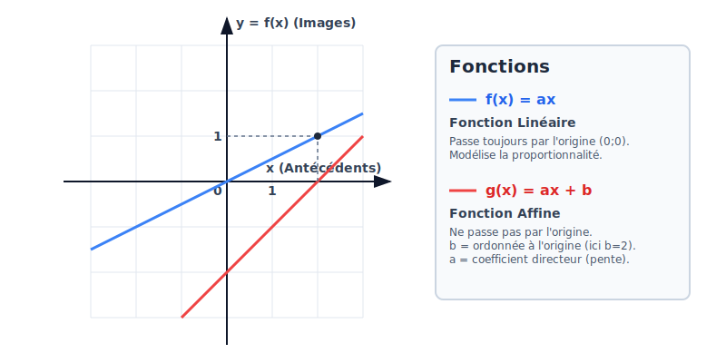

# Notion de Fonction

<callout type="info" title="Introduction">
Une fonction mathématique, c'est comme une machine qui transforme un nombre en un autre fonctionnant selon une règle précise. Ce concept est fondamental car il permet de modéliser l'évolution d'une situation : la course d'une voiture, l'évolution d'une maladie, ou le coût d'un abonnement téléphonique.
</callout>

<callout type="info" title="Le saviez-vous ?">
Le mot "fonction" a été utilisé pour la première fois en mathématiques par Gottfried Wilhelm Leibniz à la fin du 17ème siècle. Aujourd'hui, les fonctions sont à la base de toute la programmation informatique !
</callout>

<concept-card title="Le réflexe en Maths" icon="Calculator" description="Au Brevet, toutes les traces de recherche sont prises en compte. **Même si ta démarche n'aboutit pas, écris-la !**" theme="info"></concept-card>

## 1. La machine mathématique 🤖

Imagine une fonction comme une machine magique dans une usine. Tu fais entrer une matière première (un nombre), la machine fait son travail (un calcul), et il en ressort un produit fini (un nouveau nombre).

<definition-box term="Le vocabulaire indispensable">

*   **L'Antécédent ($x$)** : C'est ce qui rentre dans la machine. (Le nombre de départ).
*   **L'Image ($f(x)$)** : C'est ce qui sort de la machine. (Le résultat).

</definition-box>

<callout type="tip" title="Astuce pour ne plus confondre !">

Dans l'alphabet, le **A** de Antécédent est avant le **I** de Image.  
L'Antécédent est donc le nombre d'**A**vant, l'Image est le nombre d'**I**ci (à la fin).

</callout>

*   **Notation** : On écrit $f(x) = 2x + 3$. Ça se lit "f de x égale 2x plus 3".
*   **Règle d'or** : Un nombre de départ ($x$) ne peut donner qu'**un seul** résultat. Mais attention, un résultat (image) peut provenir de plusieurs nombres de départ différents !

### 2. Les 3 façons de présenter une fonction 📊

Au Brevet, on peut te présenter une fonction de 3 manières différentes. Tu dois savoir passer de l'une à l'autre.

1.  **La formule (Expression algébrique)** : $f(x) = x^2 - 3$
2.  **Le tableau de valeurs** : 
    * Ligne du haut = les $x$ (antécédents)
    * Ligne du bas = les $f(x)$ (images)
3.  **Le graphique** :
    * L'axe horizontal (en bas) = les $x$ (antécédents).
    * L'axe vertical (sur le côté) = les $f(x)$ (images).

<method-box  title="Lire un graphique"  steps='["Pour trouver l&apos;image de 2 : Je me place à 2 sur l&apos;axe horizontal, je monte jusqu&apos;à la courbe, et je lis le résultat sur l&apos;axe vertical.", "Pour trouver le(s) antécédent(s) de 4 : Je me place à 4 sur l&apos;axe vertical, je trace une ligne horizontale, et je regarde à quels endroits elle coupe la courbe (il peut y en avoir plusieurs !)."]' ></method-box>
### 3. Les stars du Brevet : Fonctions Affines et Linéaires ⭐

Parmi toutes les fonctions qui existent, il y en a deux que tu dois connaître sur le bout des doigts.

<affine-function-svg></affine-function-svg>

*   **La Fonction Affine** : $f(x) = ax + b$
    *   C'est un tarif avec un abonnement fixe. (Ex: 10€ par mois + 2€ par film).
    *   $a$ = le coefficient directeur (la pente de la droite).
    *   $b$ = l'ordonnée à l'origine (le prix de l'abonnement de départ).
    *   **Dessin** : C'est une **droite** (qui ne passe pas forcément par zéro).

*   **La Fonction Linéaire** : $f(x) = ax$
    *   C'est un tarif simple, sans abonnement. (Ex: 2€ par film).
    *   C'est la traduction mathématique de la **proportionnalité**.
    *   **Dessin** : C'est une **droite qui passe pile par l'origine** $(0;0)$.

<flashcard front="Si une droite ne passe pas par l'origine, est-ce une situation de proportionnalité ?" back="Non ! Pour qu'il y ait proportionnalité, la droite DOIT passer par l'origine (0;0). C'est une fonction linéaire."></flashcard>

## 📝 Entraînement

<mini-quiz  question="Si je te demande de 'trouver l'antécédent de 14' par la fonction f(x) = 2x, que cherches-tu ?"  options='["L&apos;image de 14","Le nombre qu&apos;on a rentré pour obtenir 14","Le calcul 14 × 2"]'  correctAnswer="1"  explanation="Chercher l'antécédent de 14, c'est trouver quel x on a mis dans la machine pour que le résultat final (l'image) soit 14. Ici, c'est 7 (car 2×7 = 14)."></mini-quiz>

<mini-quiz  question="Si f(x) = x² et que je cherche l'image de 3. Que dois-je faire ?"  options='["Résoudre x² = 3","Calculer 3²","Diviser 3 par 2"]'  correctAnswer="1"  explanation="Chercher l'image, c'est chercher le résultat. Donc on fait rentrer 3 dans la machine : f(3) = 3² = 9."></mini-quiz>

<mini-quiz  question="Parmi ces fonctions, laquelle est une fonction linéaire ?"  options='["f(x) = 5x + 2","f(x) = 2x²","f(x) = 4x","f(x) = -x + 1"]'  correctAnswer="2"  explanation="Une fonction linéaire s'écrit sous la forme f(x) = ax. Ici, c'est f(x) = 4x. (5x + 2 est affine, 2x² n'est ni affine ni linéaire)."></mini-quiz>

<mini-quiz question="Si f(x) = 3x - 1, quelle est l'image de 2 ?" options='["1","5","6","7"]' correctAnswer="1" explanation="On remplace x par 2 dans la formule : f(2) = 3 × 2 - 1 = 6 - 1 = 5."></mini-quiz>

<mini-quiz question="Si le graphique d'une fonction est une droite passant par l'origine, cette fonction est :" options='["Constante","Affine mais pas linéaire","Linéaire","Carrée"]' correctAnswer="2" explanation="Une fonction linéaire traduit une situation de proportionnalité, sa représentation graphique est donc obligatoirement une droite passant par l'origine."></mini-quiz>

<brevet-checklist items='[ "Je sais faire la différence entre image et antécédent.", "Je sais calculer l&apos;image d&apos;un nombre à partir d&apos;une formule.", "Je sais lire une image et un antécédent sur un graphique.", "Je sais reconnaître une fonction affine et une fonction linéaire." ]'></brevet-checklist>
