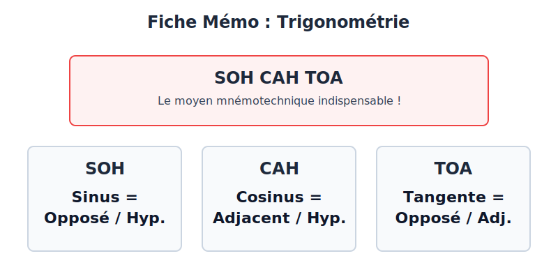

# Trigonométrie

<callout type="info" title="Introduction">
La trigonométrie, c'est l'outil magique qui permet de faire le pont entre les longueurs d'un triangle et l'ouverture de ses angles. Grâce au sinus, au cosinus et à la tangente, tu pourras calculer des hauteurs inaccessibles (comme un arbre ou une montagne) juste en regardant un angle !
</callout>

<callout type="info" title="Le saviez-vous ?">
Le mot "trigonométrie" vient du grec "trigonon" (triangle) et "metron" (mesure). Les premiers à l'utiliser étaient les astronomes de l'Antiquité pour calculer la distance entre les étoiles et les planètes !
</callout>

<concept-card title="Le réflexe en Maths" icon="Calculator" description="Au Brevet, toutes les traces de recherche sont prises en compte. **Même si ta démarche n'aboutit pas, écris-la !**" theme="info"></concept-card>

## 1. La Trigonométrie : SOH CAH TOA à la rescousse 🦸‍♂️

La trigonométrie, c'est comme le théorème de Pythagore, mais avec des **angles**. Et comme Pythagore, elle ne fonctionne **QUE dans les triangles rectangles**.

<callout type="warning" title="Attention !">
Avant d'écrire une seule formule, vérifie toujours que ton triangle est rectangle. Si ce n'est pas le cas, tu dois d'abord le prouver ou chercher une autre méthode !
</callout>

<trigonometry-svg></trigonometry-svg>

<Flashcard front="SOH" back="Sinus = Opposé / Hypoténuse"></Flashcard>
<Flashcard front="CAH" back="Cosinus = Adjacent / Hypoténuse"></Flashcard>
<Flashcard front="TOA" back="Tangente = Opposé / Adjacent"></Flashcard>

<callout type="tip" title="Le mot magique : SOH CAH TOA">

C'est LA formule à écrire au brouillon dès que tu vois un exercice de trigo :
*   **SOH** : **S**in(angle) = **O**pposé / **H**ypoténuse
*   **CAH** : **C**os(angle) = **A**djacent / **H**ypoténuse
*   **TOA** : **T**an(angle) = **O**pposé / **A**djacent

</callout>

<method-box  title="Comment choisir la bonne formule ?"  steps='["Repère l&apos;angle qui t&apos;intéresse (celui que tu connais ou que tu cherches).", "Identifie les 3 côtés par rapport à cet angle : l&apos;Hypoténuse (le plus long), l&apos;Opposé (en face de l&apos;angle), l&apos;Adjacent (celui qui touche l&apos;angle, mais qui n&apos;est pas l&apos;hypoténuse).", "Regarde ce que tu CONNAIS et ce que tu CHERCHES. Choisis la formule qui contient ces deux mots."]'  example="Je connais l'Adjacent, je cherche l'Opposé. Opposé et Adjacent = <b>TOA</b>. J'utilise la Tangente !"></method-box>
### 2. Calculer une longueur vs Calculer un angle

Il y a deux façons d'utiliser tes formules :

#### Calculer une longueur
_Tu connais 1 angle et 1 côté._

1. Écris la formule (ex: $cos(30^\circ) = \frac{x}{10}$)
2. Place $1$ sous le cosinus : $\frac{cos(30^\circ)}{1} = \frac{x}{10}$
3. Fais un produit en croix : $x = 10 \times cos(30^\circ)$

#### Calculer un angle
_Tu connais 2 côtés._

1. Écris la formule (ex: $sin(x) = \frac{6}{10} = 0,6$)
2. Utilise la touche **2nd** ou **Shift** de ta calculatrice.
3. Tape $sin^{-1}(0,6)$ ou $Arcsin(0,6)$.

### 3. Exercice Type Brevet : La Navigation Maritime ⛵

## 📝 Entraînement

<brevet-exercise  title="Mission de Sauvetage" question="Un phare de 50m de hauteur surveille la mer. Un gardien voit un bateau en détresse avec un angle de dépression de 15°. À quelle distance du pied du phare se trouve le bateau ?" draft="Dessine un triangle rectangle. Le phare est la hauteur (côté opposé à l'angle si on regarde depuis le bateau, ou adjacent si on regarde depuis le haut). Utilisons l'angle au niveau du bateau qui est aussi de 15° (alternes-internes)." solution="Soit $d$ la distance recherchée. Dans le triangle rectangle formé par le phare et la mer : 1. On cherche l'Adjacent (la distance au sol). 2. On connaît l'Opposé (la hauteur du phare = 50m). 3. On connaît l'angle (15°). Opposé et Adjacent = **Tangente (TOA)**. $tan(15^\circ) = \frac{50}{d}$ $d = \frac{50}{tan(15^\circ)} \approx \frac{50}{0,268} \approx 186,6 \text{ m}$."></brevet-exercise>

<mini-quiz  question="Si je cherche 'l&apos;Opposé' et que je connais 'l&apos;Adjacent' et mon angle, quelle touche vais-je utiliser ?"  options='["Sinus","Cosinus","Tangente"]'  correctAnswer="2"  explanation="Opposé et Adjacent, c'est TOA (Tangente = Opposé / Adjacent)."></mini-quiz>

<mini-quiz  question="Dans mon triangle, l&apos;hypoténuse mesure 10 cm et le côté opposé à l&apos;angle $\alpha$ mesure 5 cm. Que vaut le sinus de $\alpha$ ?"  options='["2","0.5","50","15"]'  correctAnswer="1"  explanation="Sinus = Opposé / Hypoténuse = 5 / 10 = 0.5."></mini-quiz>

<mini-quiz  question="Comment se nomme le côté le plus long dans un triangle rectangle ?"  options='["L&apos;Adjacent","L&apos;Opposé","L&apos;Hypoténuse","Le Diamètre"]'  correctAnswer="2"  explanation="L'hypoténuse est le côté le plus long, toujours situé en face de l'angle droit."></mini-quiz>

<mini-quiz  question="Quelle touche de calculatrice permet de trouver un ANGLE quand on connaît son cosinus ?"  options='["cos","cos²","cos⁻¹ (ou Arccos)","tan"]'  correctAnswer="2"  explanation="Les touches Arccos, Arcsin et Arctan (souvent écrites avec un petit -1) sont dédiées à la recherche de la mesure d'un angle."></mini-quiz>

<mini-quiz question="Si cos(x) = 0.5, que vaut l'angle x ?" options='["30°","45°","60°","90°"]' correctAnswer="2" explanation="Sur la calculatrice, Arccos(0.5) donne 60°. C'est un angle remarquable à connaître."></mini-quiz>

<mini-quiz question="Le sinus et le cosinus d'un angle aigu sont toujours des nombres compris entre :" options='["-1 et 1","0 et 1","1 et 100","0 et 90"]' correctAnswer="1" explanation="L'hypoténuse étant le côté le plus long, le rapport (Côté / Hypoténuse) est forcément inférieur à 1."></mini-quiz>

<brevet-checklist items='[ "Je sais écrire SOH CAH TOA sur mon brouillon.", "Je sais nommer les 3 côtés d&apos;un triangle rectangle par rapport à un angle.", "Je sais utiliser Arccos/Arcsin/Arctan pour trouver un angle." ]'></brevet-checklist>
