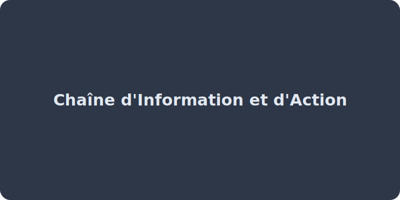

# Chaînes d'information et d'action

<callout type="info" title="Introduction">
Comment fonctionne un portail automatique ou un thermostat ? Tout système automatisé est composé de deux grandes chaînes invisibles : la **chaîne d'information** (le cerveau) et la **chaîne d'action** (les muscles).
</callout>

<callout type="warning" title="Rappel visuel">
Dans un schéma de système automatisé complet, on place toujours la chaîne d'information en haut (le cerveau), et la chaîne d'action en bas (les muscles et nerfs). Les informations transitent du haut vers le bas (les ordres).
</callout>

<chaine-info-action-svg></chaine-info-action-svg>

<concept-card title="Démarche Scientifique" icon="FlaskConical" description="Lis toujours l'introduction de l'énoncé. Elle contient le **problème à résoudre** et justifie toutes les questions qui suivent." theme="info"></concept-card>

## 1. La chaîne d'information
C'est elle qui capte et traite les données.
1.  **Acquérir** : Le rôle des **capteurs** (capteur de présence, thermomètre, bouton). Ils prélèvent une information dans l'environnement.
2.  **Traiter** : Le rôle de la partie commande (carte électronique, microcontrôleur). Elle analyse les données et prend une décision selon son programme.
3.  **Communiquer** : Elle envoie des ordres à la chaîne d'action ou informe l'utilisateur (via un écran, une LED...).
### 2. La chaîne d'action
C'est elle qui réalise l'action physique.
1.  **Alimenter** : Fournir l'énergie (batterie, prise secteur).
2.  **Distribuer** : Le rôle des contacteurs ou relais qui laissent (ou non) passer l'énergie vers les moteurs sur ordre de la chaîne d'information.
3.  **Convertir** : Le rôle des **actionneurs** (moteurs, lampes, résistances). Ils transforment l'énergie (ex: électrique en mécanique).
4.  **Transmettre** : Adapter le mouvement (engrenages, courroies) jusqu'à l'effecteur (ex: la roue, le vantail du portail).

<drag-and-drop-list title="Associe chaque composant à sa grande fonction ! (Information ou Action ?)" items='[ {"id": "1", "content": "Un capteur de mouvement", "match": "Fonction Acquérir (Information)"}, {"id": "2", "content": "Une carte électronique programmée", "match": "Fonction Traiter (Information)"}, {"id": "3", "content": "Un Moteur", "match": "Fonction Convertir (Action)"}, {"id": "4", "content": "Des engrenages", "match": "Fonction Transmettre (Action)"} ]' ></drag-and-drop-list>

<fill-in-the-blanks text="Le bloc qui fournit au système entier son énergie (batterie, 220v) est le bloc [Alimenter|Distribuer|Convertir]. Celui qui s'occupe de laisser passer cette puissance jusqu'au vérin ou au moteur selon la volonté de la carte s'appelle [Distribuer|Convertir|Alimenter]. Ensuite le moteur s'occupe de [Convertir|Alimenter|Distribuer] ce courant en mouvement final de l'objet." title="Suis l'énergie ! (Chaîne d'action)" ></fill-in-the-blanks>

<flashcard front="Vrai ou Faux : Un Actionneur fait partie de la chaîne d'information." back="Faux ! Actionneur = Action. (Moteurs, vérins, voyants). Ceux qui récupèrent l'information sont les CAPTEURS."></flashcard>

## 📝 Entraînement

<mini-quiz question="Dans un système automatisé, à quelle fonction correspond un capteur de température ?" options='["Acquérir","Traiter","Convertir","Distribuer"]' correctAnswer="0" explanation="Le capteur de température prélève une information physique de l'environnement, cela correspond à la fonction 'Acquérir' de la chaîne d'information."></mini-quiz>

<brevet-checklist items='[ "Je connais les 3 blocs de la chaîne d&apos;information (Acquérir, Traiter, Communiquer).", "Je connais les 4 blocs de la chaîne d&apos;action (Alimenter, Distribuer, Convertir, Transmettre).", "Je sais associer un composant (capteur, moteur) à sa fonction." ]'></brevet-checklist>
