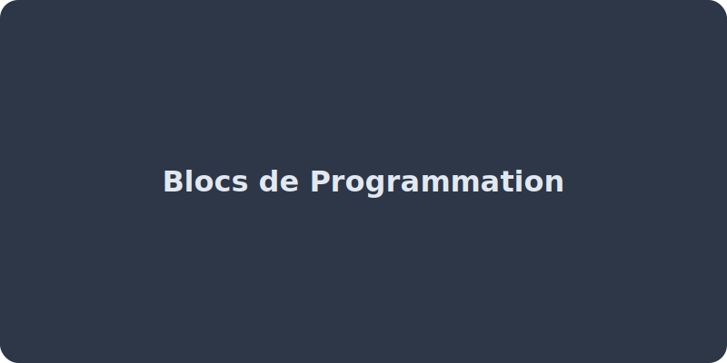

# Programmation et algorithmique



<callout type="info" title="Introduction">
Un ordinateur ne sait faire que ce qu'on lui demande ! Pour lui donner des ordres, on écrit d'abord un **algorithme** (une méthode en français), puis on le traduit dans un langage de programmation qu'il peut exécuter.
</callout>

<concept-card title="Démarche Scientifique" icon="FlaskConical" description="Lis toujours l'introduction de l'énoncé. Elle contient le **problème à résoudre** et justifie toutes les questions qui suivent." theme="info"></concept-card>

## 1. Qu'est-ce qu'un algorithme ?
C'est une suite d'instructions logiques permettant de résoudre un problème (ex: calculer une trajectoire, trier des mots). 
On le représente souvent sous forme de schéma (organigramme (logigramme)) avec des cases :
*   Ovale : Début / Fin
*   Rectangle : Action
*   Losange : Condition (Si... Alors...)

<algorithmique-blocs-svg></algorithmique-blocs-svg>

<callout type="warning" title="Rappel de lecture">
L'ordinateur est "bête et discipliné". À moins d'une instruction spéciale (boucle, saut), tes instructions (les blocs imbriqués) seront toujours lues strictement de manière **séquentielle**, c'est-à-dire l'une après l'autre, de haut en bas.
</callout>
### 2. Les éléments de base en programmation (Scratch / Python)
*   **Les variables** : Des "boîtes" avec un nom dans lesquelles l'ordinateur stocke une valeur qui peut changer (un score, une température, la position X).
*   **Les boucles (Répétition)** : Elles permettent de répéter un bloc d'instructions indéfiniment ("Répéter indéfiniment") ou un nombre précis de fois ("Répéter 10 fois").
*   **Les conditions (Test)** : Elles permettent de faire des choix. (`SI {condition} ALORS {faire ceci} SINON {faire cela}`).

<fill-in-the-blanks text="Pour conserver le pseudonyme d'un joueur, j'utilise une [variable|fonction|boucle]. Pour dire que j'ai perdu [Si|Quand|Alors] ma jauge est à 0, j'utilise une [condition|variable|boucle]. Pour faire clignoter un voyant encore et encore, j'utilise une [boucle|condition|variable]." title="Vérification 1 : Logique" ></fill-in-the-blanks>

### 3. Les événements
Un programme réagit souvent à des éléments extérieurs : on appelle cela la programmation événementielle.
*(Exemple : "QUAND le drapeau vert est cliqué", ou "QUAND le capteur détecte un obstacle").*

<drag-and-drop-list title="Associe chaque principe de programmation" items='[ {"id": "1", "content": "Une boîte stockant une valeur", "match": "La variable"}, {"id": "2", "content": "Répéter 10 fois", "match": "La boucle"}, {"id": "3", "content": "Si... Alors...", "match": "La condition"} ]' ></drag-and-drop-list>

### 4. Programmation graphique vs textuelle

On peut programmer de deux manières différentes, mais qui reposent sur les mêmes concepts :

| Programmation graphique (Scratch) | Programmation textuelle (Python) |
|:---|:---|
| Blocs visuels à emboîter | Lignes de code écrites |
| Pas de fautes de syntaxe possibles | Attention aux majuscules, espaces, deux-points |
| "avancer de 10" | `turtle.forward(10)` |
| "répéter 10 fois" | `for i in range(10):` |
| "si ... alors ..." | `if condition:` |
| Idéal pour débuter | Plus puissant et professionnel |

<formula-box title="Comparaison Scratch ↔ Python (carré)">
```python
# Python avec la bibliothèque Turtle
import turtle
t = turtle.Turtle()

for i in range(4):
    t.forward(100)
    t.right(90)

turtle.done()
```
Ce programme trace un carré de 100 pixels de côté, exactement comme le ferait le bloc Scratch "Répéter 4 fois (avancer de 100, tourner à droite de 90°)".
</formula-box>

<callout type="tip" title="Astuce Python">
En Python, l'**indentation** (les espaces au début des lignes) est cruciale ! Tout ce qui est dans la boucle `for` doit être décalé de 4 espaces. Si tu oublies, le programme ne fonctionnera pas.
</callout>

<flashcard front="Quelle est la différence entre Scratch et Python ?" back="Scratch utilise des blocs visuels qu'on emboîte (programmation graphique), alors que Python utilise du texte qu'on écrit (programmation textuelle). Python est plus puissant mais exige de respecter la syntaxe (indentation, parenthèses, deux-points)."></flashcard>

### 5. Écrire, mettre au point et exécuter un programme

Un programme ne fonctionne jamais du premier coup ! Savoir le **tester** et le **corriger** fait partie du travail.

*   **Débogage (debugging)** : Trouver et corriger les bugs (erreurs) dans le programme.
*   **Erreur de syntaxe** : Le langage n'est pas respecté (ex: oubli d'un deux-points en Python). Le programme ne s'exécute pas.
*   **Erreur de logique** : Le programme s'exécute mais fait quelque chose d'autre que ce qui était prévu (ex: tourner à gauche au lieu de tourner à droite).
*   **Tester pas à pas** : Exécuter le programme instruction par instruction pour vérifier chaque étape.

<method-box title="Méthode de débogage" steps='["Lire attentivement le message d&apos;erreur (il indique souvent la ligne du problème).","Tester chaque partie du programme séparément (isoler le problème).","Ajouter des affichages temporaires pour voir la valeur des variables.","Vérifier les conditions aux limites : que se passe-t-il si la variable vaut 0 ou un nombre négatif ?"]' example="Un programme qui calcule la moyenne plante si la liste de notes est vide. La solution : ajouter une condition `if len(notes) &gt; 0:` avant de diviser."></method-box>

<concept-card title="À savoir pour le Brevet" icon="GraduationCap" description="Au Brevet, on peut te demander de : 1) Compléter un programme Scratch, 2) Repérer et corriger une erreur, 3) Expliquer ce que fait un bloc d'instructions, 4) Proposer une modification." theme="primary"></concept-card>

<flashcard front="Quelle est la différence entre une erreur de syntaxe et une erreur de logique ?" back="L'**erreur de syntaxe** empêche le programme de s'exécuter (le code est mal écrit). L'**erreur de logique** laisse le programme s'exécuter mais produit un mauvais résultat (l'algorithme est mal conçu)."></flashcard>

## 📝 Entraînement

<mini-quiz question="Que fait le bloc de boucle 'Répéter 4 fois : (Avancer de 50, Tourner à droite de 90°)' en Scratch ?" options='["Dessiner un cercle", "Dessiner un carré", "Dessiner un triangle", "Rien du tout"]' correctAnswer="1" explanation="En avançant puis en tournant à angle droit (90 degrés) 4 fois de suite, le lutin revient à son point de départ après avoir tracé un carré parfait."></mini-quiz>

<mini-quiz question="Comment appelle-t-on le concept qui permet à un programme de faire un choix (ex: SI la touche Espace est pressée ALORS sauter, SINON avancer) ?" options='["Une boucle", "Une variable", "L&apos;état mémoire", "Une condition (ou Test)"]' correctAnswer="3" explanation="Les blocs 'Si... Alors... Sinon' sont des conditions. Ils permettent au programme de s'adapter à la situation."></mini-quiz>

<mini-quiz question="En Python, que signifie l'instruction suivante : for i in range(4):" options='["Répéter 4 fois", "Dessiner un carré", "Créer une variable i", "Tant que i &lt; 4"]' correctAnswer="0" explanation="En Python, 'for i in range(4):' est une boucle qui répète le bloc indenté 4 fois (i prend successivement les valeurs 0, 1, 2, 3)."></mini-quiz>

<mini-quiz question="Un programme s'exécute mais affiche un résultat faux. De quel type d'erreur s'agit-il ?" options='["Erreur de syntaxe", "Erreur de logique", "Erreur d&apos;indentation", "Erreur réseau"]' correctAnswer="1" explanation="L'erreur de logique ne bloque pas l'exécution mais produit un résultat incorrect car l'algorithme ou sa traduction est mal conçu."></mini-quiz>

<brevet-checklist items='[ "Je sais lire un algorithme simple (en blocs type Scratch).", "Je fais la différence entre une boucle (répétition) et un test (Si... Alors...).", "Je comprends l&apos;utilité d&apos;une variable.", "Je connais la différence entre Scratch (graphique) et Python (textuel).", "Je sais ce qu&apos;est le débogage et les types d&apos;erreurs." ]'></brevet-checklist>
